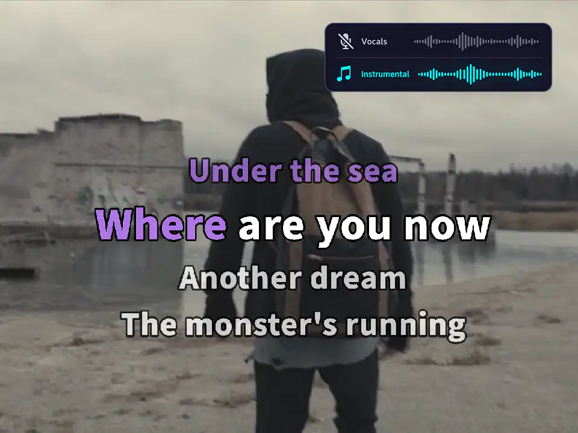
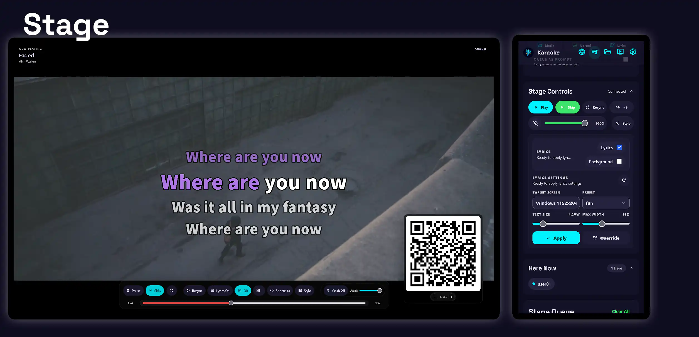
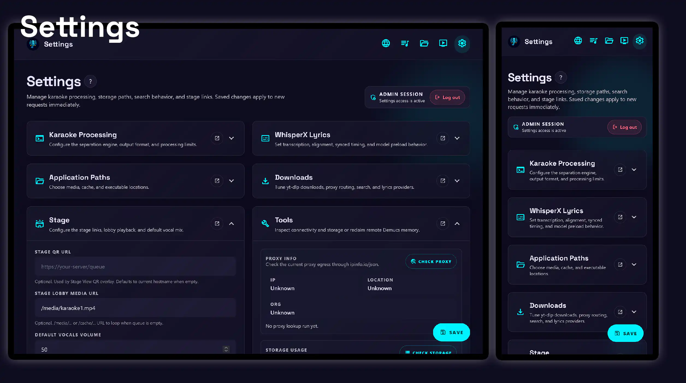
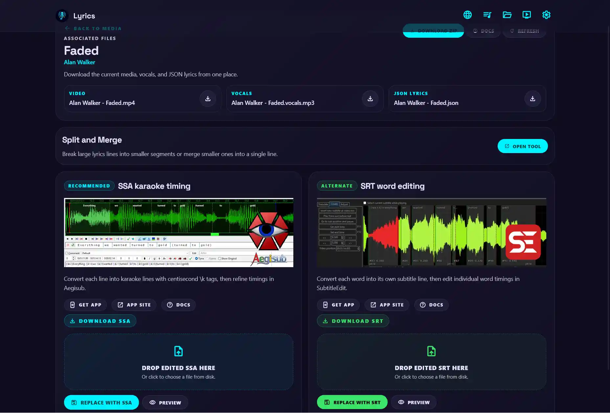

# DMKaraoke


DMKaraoke is a lightweight web application for home karaoke. It uses machine learning to separate vocals and create word-by-word synced lyrics. The application is **completely free**, with **no advertisements** and **zero cloud subscription fees**. It creates karaoke on your own device.

## Table of Contents

- [Quick Start](#quick-start)
  - [Karaoke App Only](#karaoke-app-only)
  - [Demucs/WhisperX Service](#demucswhisperx-service)
  - [Clients](#clients)
- [Features](#features)
- [Screenshots](#screenshots)
- [Comparison](#comparison)
- [Translation](#translation)
- [Development](#development)
- [License](#license)

## Quick Start

This section is meant to help most people get the application running quickly with mostly default settings. For detailed configuration and usage, please review the [detailed installation guide](https://vttc08.github.io/demucs-karaoke-app/getting-started/overview/).

### Karaoke App Only

For a typical Linux home server setup, Docker installation is recommended and it's listed here.

<details>
<summary>Docker installation</summary>

1. Download Docker Compose and `.env.example`.

   ```bash
   wget https://raw.githubusercontent.com/vttc08/demucs-karaoke-app/refs/heads/main/compose.yml
   wget https://raw.githubusercontent.com/vttc08/demucs-karaoke-app/refs/heads/main/.env.example
   ```

1. Prepare the environment and folders.

   ```bash
   mkdir -p data
   mv .env.example .env
   ```

   - The application runs as a non-root user by default, so the `data` folder must be created beforehand.
   - You can change `user: uid:gid` to match your host permissions.

1. Configure the environment using a text editor such as `vim` or `nano`.

   - Review both the `environment` section in `compose.yml` and `.env`. The default configuration should be sufficient for most use cases.
   > Note: Musixmatch and Last.fm tokens are required for the best lyrics experience. Without them, lyrics functionality will be degraded.
   - [Last.fm token](https://www.last.fm/api/authentication)
   - Musixmatch Token (desktop app required): [follow this guide](https://spicetify.app/docs/faq#sometimes-popup-lyrics-andor-lyrics-plus-seem-to-not-work)

1. Start the application.

   ```bash
   docker compose up
   # Use `-d` to start in the background, then use `docker compose logs -f` to view logs.
   ```

1. Configure the admin user and default presets.

   ```bash
   docker compose exec -it karaoke python scripts/admin_user.py create --username admin
   docker compose exec -it karaoke python scripts/default_presets.py
   ```

Optional: configure stage loop (documentation link to be added later).

You should be able to search, download or queue existing karaoke songs.

</details>

### Demucs/WhisperX Service

For advanced features such as vocal separation and karaoke lyrics timing, the Demucs service is required. This service can be installed on a different computer. An Nvidia GPU is preferred for CUDA acceleration, but CPU-only mode will work more slowly.

> Note: I do not have a Linux machine with Nvidia graphics, so these steps have only been tested on Windows. If you have experience running GPU-accelerated machine learning in Linux or Docker, feel free to test and contribute.

<details>
<summary>Installing Demucs service</summary>

1. Install [Python 3.10](https://www.python.org/downloads/release/python-3100/).

   - Only Python 3.10 has been tested with all ML dependencies. Newer Python versions may not work.
   - You can also try using `uv` or `conda`, as long as you have a working virtual environment that can run `whisperx` and `demucs`.

1. Download the code.

   ```powershell
   git clone https://github.com/vttc08/demucs-karaoke-app
   ```

   - If Git is not available, you can download and extract the repository as a ZIP file, then open the resulting folder in PowerShell.

1. Install dependencies.

   ```powershell
   py -3.10 -m venv .venv
   .\.venv\Scripts\Activate.ps1
   python -m pip install --upgrade pip
   ```

   Download [PyTorch](https://pytorch.org/get-started/locally/):

   ```powershell
   pip install torch==2.8.0+cu126 torchaudio==2.8.0+cu126 torchvision==0.23.0+cu126 --index-url https://download.pytorch.org/whl/cu126
   ```

   - Choose CPU if your GPU doesn't support CUDA.

   Project dependencies:

   ```powershell
   cd demucs-karaoke-app # the location where you downloaded the code
   cd demucs_svc
   pip install -r requirements.txt
   ```

1. Prepare a Hugging Face token. Some WhisperX models require authentication.

   Accept the license agreement for the following models:

   - [pyannote/speaker-diarization](https://huggingface.co/pyannote/speaker-diarization)
   - [pyannote/segmentation](https://huggingface.co/pyannote/segmentation)

   Generate a personal access token from [Hugging Face](https://huggingface.co/settings/tokens) and save it to a file.

   ```powershell
   New-Item -ItemType Directory -Force -Path $env:HF_HOME | Out-Null
   $env:HF_TOKEN_PATH="$env:HF_HOME\token"
   Set-Content -Path $env:HF_TOKEN_PATH -Value "<your_huggingface_token>"
   ```

   If `HF_HOME` is not set, check your system or user environment variables.

1. Run the application.

   ```powershell
   uvicorn.exe app:app --host 0.0.0.0 --port 8001
   ```

1. Verify application health.

PyTorch:

   ```powershell
   python -c "import torch, torchaudio; print(torch.__version__); print(torchaudio.__version__); print(torch.cuda.is_available())"
   ```

Web app:

   ```powershell
   (curl.exe -fsSL http://localhost:8001/health | ConvertFrom-Json).status # ok
   (curl.exe -fsSL http://localhost:8001/health | ConvertFrom-Json).supported_backends # demucs sherpa_spleeter
   ```

#### Conda quick setup

If you prefer Conda, create an environment and install the Demucs service dependencies with:

```powershell
conda create --name demucs-karaoke python=3.10
conda activate demucs-karaoke
cd demucs-karaoke-app\demucs_svc
python -m pip install -r requirements.txt
```

Install the matching PyTorch build using the command above, adjusted for your CUDA or CPU setup. Then continue with the Hugging Face token, service startup, and health-check steps.

</details>

<details>
<summary>Configuration web interface</summary>

Navigate to [http://application:8000/login](http://application:8000/login), or use the server's IP address (and base URL, if configured). Log in, then navigate to [/settings](http://application:8000/settings).

Under Karaoke Processing, enter the IP address of the server you just installed Demucs service on.

- The main app server must be able to reach Demucs. Check [Troubleshooting](README.dev.md#troubleshooting) if it cannot.
- If the Demucs service is running on another network, you can use [Tailscale](https://tailscale.com/kb/1017/install) or a [Cloudflare Tunnel](https://developers.cloudflare.com/cloudflare-one/connections/connect-networks/) for reachability.

Scroll down to the bottom and click `Check Demucs`.

For more Demucs-related configuration, please refer to [Separation Backends](docs/separation-backends.md).

</details>

### Clients

<details>
<summary>Client requirements</summary>

You'll preferably need a desktop computer that can output video over HDMI and sound to your karaoke setup. This quick start does not cover complex karaoke AV setups. A modern web browser such as Chrome, Edge, or Firefox will work.

Android is also supported and can display the stage. On iOS devices, multi-track audio is not supported, so iPhones and iPads cannot play instrumental and vocal tracks simultaneously. See the iOS device limitations and workarounds documentation for more information.

</details>

## Features

- **User queues**: A mobile-friendly page for searching and adding songs with real-time updates.
- **Video and lyrics downloads**: Powered by YouTube, Musixmatch, and more; choose any karaoke style.
- **Flexible architecture**: Heavy ML dependencies are decoupled, keeping the main application lightweight and suitable for most deployments.
- **AI/ML karaoke processing**: Remove vocals from songs with Demucs and generate word-by-word karaoke timing with WhisperX.
- **Customizable karaoke display**: Change the lyrics font, style, and display on stage.
- **Bring your own media**: Upload your own songs and videos for AI/ML karaoke processing.
- **Media editor**: Use the basic video trimmer and subtitle editor to fix minor karaoke inconsistencies.
- **Highly configurable**: Start with sensible defaults, then fine-tune settings and scripting options.
- **Multilingual**: Support English, Chinese, and more for the user interface and lyrics display.

## Screenshots

| Standard YouTube karaoke | Lyrics video + vocal removal | Immersive (MV + lyrics) |
| --- | --- | --- |
|  |  |  |

<details>
<summary>Screenshots</summary>







| Subtitle Editor | Video Trimmer | Add Vocals |
| --- | --- | --- |
|  |  |  |

</details>


## Comparison

Why not YouTube karaoke (Sing King, Musisi, Zoom)?

There are many applications that also use YouTube to display karaoke. The limitations of simple YouTube videos include:

- Not all songs have premade karaoke versions, especially non-English songs.
- Lyric styles and branding are not customizable.
- Vocal backing tracks cannot be turned on or off for practice.

As long as there is audio and lyrics, this app can make karaoke tracks from it.

## Translation

Currently, the application is translated into English, simplified and traditional Chinese, and French, while the documentation is translated into simplified Chinese only. You can help with translation.

The translation files are located in `locales/` as `<language_code>.json` files containing key-value pairs for UI strings and their translations.

```json
  "lyrics.help_default": "Search or upload lyrics to continue.",
```

Create a new file and add your translated strings. Please ensure all keys are translated before creating a pull request.

When completed, run the following commands to validate all keys are translated.

```bash
uv run pytest tests/routes/pages.py::test_locale_catalogs_have_matching_keys
uv run python scripts/audit_i18n.py --check
```

Modifying translation strings is welcome too.

## Development

For information about contributing, development setup, testing, and AI-agent workflows, see [README.dev.md](README.dev.md).

To add new features or fix bugs, please create a new branch:

```bash
git checkout -b feat/my-feature
```

The project uses `uv` for dependency management. See the [development setup instructions](README.dev.md#setup) for configuring the environment with dependencies.

Run pytest before committing or opening a pull request:

```bash
uv run pytest
```

When making a pull request, select the base branch `dev` instead of `main`.

## License

MIT
