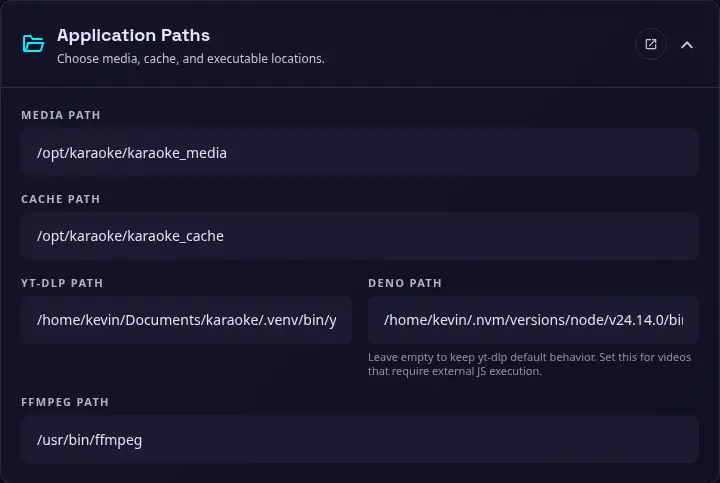

# Application Paths

{ width="400" }

Use this section to choose where the application stores media and temporary files, and which external executables it should use. These settings can also be configured with [environment variables](environments.md) when a deployment needs fixed paths.

### Media path

The directory used for downloaded, uploaded, and processed media. The application creates the directory when needed, and the running user must be able to read and write to it.

### Cache path

The directory used for temporary downloads, processing output, thumbnails, and other cache files. Cache files can be removed from the [Tools](tools.md) section when they are no longer needed.

### yt-dlp path

The path or executable name used to run yt-dlp. The application checks the active virtual environment before falling back to the system `PATH`.

### Deno path

Deno path is configured by default in Docker installation. It's highly recommended to install Deno to use this application to avoid yt-dlp download issues.

An optional path to Deno for yt-dlp external JavaScript execution. Leave this empty to keep yt-dlp's default behavior. Set it when a video source requires an external JavaScript runtime.

### FFmpeg path

The path or executable name used to run FFmpeg. FFmpeg is required for audio extraction, media conversion, and other processing tasks.
