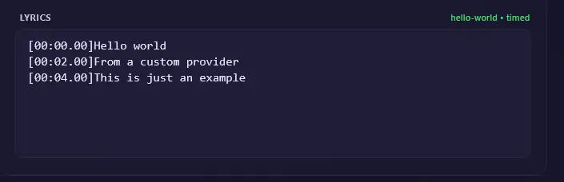

# Proveedores de letras personalizados

La aplicación puede cargar en tiempo de ejecución sus propios proveedores alternativos de letras desde archivos o directorios locales de Python.



## Configuración

Establezca `LYRICS_PROVIDER_CUSTOM_PATHS` en una lista de carpetas o archivos Python separados por comas:

```bash
LYRICS_PROVIDER_CUSTOM_PATHS=/app/custom_lyrics,/mnt/shared/lyrics_provider.py
```

### Docker

En Docker, debe montar los archivos de su proveedor personalizado en el contenedor y configurar `LYRICS_PROVIDER_CUSTOM_PATHS` con rutas del contenedor.

```yaml
      LYRICS_PROVIDER_CUSTOM_PATHS: /app/custom_lyrics
    volumes:
      - ./custom_lyrics:/app/custom_lyrics
```

## Contrato

Use IA para escribir un proveedor de letras personalizado (copie esta plantilla)
```
Quiero que me ayudes a escribir un plugin de proveedor de letras personalizado basado en las especificaciones. Obtén esta URL https://raw.githubusercontent.com/vttc08/demucs-karaoke-app/refs/heads/main/custom_lyrics_providers.md, que explica los requisitos y la estructura de un proveedor de letras personalizado, incluidos la entrada InferredSong y la salida LyricsPayload. Incluiré información sobre el proveedor de letras que quiero crear y generarás el código. Asegúrate de que el código generado cumpla los requisitos y la estructura descritos en la documentación proporcionada.
```

Cada módulo de proveedor debe definir una clase de proveedor, normalmente llamada `LyricsProvider` o `CustomLyricsProvider`.

Forma requerida:

```python
from services.lyrics_types import InferredSong, LyricsPayload


class LyricsProvider:
    name = "hello-world"

    async def fetch(self, inferred_song: InferredSong, **kwargs):
        # Implement your lyrics lookup, proxy rotation, caching, etc. here.
        return LyricsPayload()
```

Requisitos:

- La clase debe poder construirse sin argumentos.
- `name` debe ser una cadena no vacía.
- `fetch(...)` debe ser `async` (las funciones síncronas se pueden envolver con `asyncio.to_thread`).
- `fetch(...)` recibe los metadatos normalizados de la canción como `inferred_song`.
- El cargador también pasa sugerencias por palabra clave como `title` y `artist`, por lo que las implementaciones personalizadas deben aceptar `**kwargs` aunque no las usen.
- Si un proveedor no puede encontrar una coincidencia, debe devolver `None`.

## Entrada de función (`InferredSong`)

`InferredSong` es la descripción depurada, según el mejor criterio de la aplicación, de una canción. Para las búsquedas de letras, los campos importantes son:

- `title`: el título normalizado de la canción
- `artist`: el nombre normalizado del artista, cuando la aplicación ha podido inferirlo
- `source`: de dónde proceden los metadatos, como YouTube u otra ruta de entrada


## Tipo de retorno (`LyricsPayload` o `None`)


`LyricsPayload` es el tipo de retorno estructurado para los proveedores que desean ser más explícitos.

Contiene:

- `lyrics`: el texto de las letras (cadena multilínea)
- `is_synced`: si las letras tienen marcas de tiempo
- `provider`: un nombre corto para el proveedor, como `hello-world`
- `inferred_song`: el `InferredSong` usado para la búsqueda
- `provider_score`: puntuación de confianza usada internamente cuando la aplicación compara varias coincidencias alternativas
    - intervalo entre 0 y 250, donde un valor mayor es mejor
- `provider_details`: metadatos adicionales opcionales para depuración o uso futuro
- `alternatives`: tupla opcional de valores `LyricsAlternative` cuando el proveedor
  puede ofrecer otra representación del mismo resultado. Las primeras letras o letras base
  siguen siendo la opción predeterminada segura para el procesamiento; la interfaz puede elegir una alternativa TTML
  y conservar el LRC base para una degradación compatible.

Ejemplo de proveedor con una actualización TTML opcional:

```python
from services.lyrics_types import InferredSong, LyricsAlternative, LyricsPayload


class LyricsProvider:
    name = "example"

    async def fetch(self, inferred_song: InferredSong, **kwargs):
        lrc = "[00:01.00]Original synced lyrics"
        ttml = "<tt>...valid timed TTML...</tt>"
        return LyricsPayload(
            lyrics=lrc,
            is_synced=True,
            provider=self.name,
            inferred_song=inferred_song,
            alternatives=(
                LyricsAlternative(
                    lyrics=ttml,
                    format="ttml",
                    provider=self.name,
                    is_synced=True,
                ),
            ),
        )
```

El proveedor integrado Musixmatch usa este contrato para su actualización TTML opcional. Los fallos de actualización se tratan como una alternativa ausente, por lo que el resultado base de letras sigue siendo utilizable.

## Notas de implementación

- Use `httpx` para solicitudes web cuando su proveedor se comunique con una API HTTP.
- Use `subprocess` si su proveedor llama a otro programa mediante la shell.
- Un proveedor personalizado también puede actuar como proxy hacia un servidor web dedicado de letras.

## Ejemplo HelloWorld

```python
from services.lyrics_types import InferredSong, LyricsPayload
# import other libraries such as httpx, subprocess, etc. if needed

class LyricsProvider:
    name = "hello-world"

    async def fetch(self, inferred_song: InferredSong, **kwargs):
        # support both inferred_song and kwargs for title/artist hints
        title = inferred_song.title or kwargs.get("title")
        artist = inferred_song.artist or kwargs.get("artist")
        
        # Your custom logic goes here
        # lyrics = find_lyrics(title, artist)
        # is_synced = check_if_synced(lyrics)
        # score = calculate_provider_score(lyrics)

        return LyricsPayload(
            lyrics="""[00:00.00]Hello world
[00:02.00]From a custom provider
[00:04.00]This is just an example""",
            is_synced=is_synced,
            provider="hello-world",
            inferred_song=inferred_song,
            provider_score=250
        )
```

- debe importar los tipos desde `services.lyrics_types`; de otro modo, el cargador no reconocerá su proveedor
- otras variables como autenticación, proxy, etc. pueden declararse en el constructor o los atributos de la clase
- `lyrics` debe ser una cadena multilínea, no una referencia a archivo, ruta o URL.
- `is_synced` en `False` indica que son letras de texto sin formato, mientras que `True` indica que tienen marcas de tiempo.
- no devuelva un `LyricsPayload` con letras vacías; devuelva `None` en su lugar.
- no devuelva una puntuación vacía o cero si quiere que las aplicaciones consideren su proveedor como alternativa; use una puntuación de 1 o superior.
- puede usar el valor máximo de 250 para que la aplicación siempre prefiera su proveedor a los demás.
