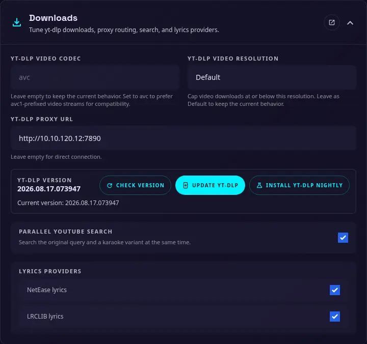

# Downloads

{ width="400" }

Use this section to control yt-dlp download preferences, proxy routing, concurrent search, and lyrics providers. These settings can also be configured with [environment variables](environments.md) when a deployment needs fixed values.

### yt-dlp video codec

An optional video codec preference for yt-dlp. Leave this empty to use yt-dlp's default selection. 

Apple devices browser have limited codecs support, set it to `avc` in case of video playback issues.

### yt-dlp video resolution

The maximum preferred video resolution. Choose `Default` to keep the current behavior, or select `360p`, `480p`, `720p`, `1080p`, or `2160p` to cap video downloads at that resolution or below.

### yt-dlp proxy URL

An optional proxy URL for yt-dlp and related outbound requests. HTTP, HTTPS, SOCKS4, and SOCKS5 proxy URLs are supported. Leave this empty to connect directly.

### yt-dlp version

Use **Check version** to display the installed yt-dlp version. **Update yt-dlp** installs the stable release, while **Install yt-dlp Nightly** installs the nightly release. Update yt-dlp when a provider changes or when the current version no longer works with a video source.

### Parallel YouTube Search

Search the original query and a karaoke variant at the same time. This can return more useful results, but it creates additional outbound requests.

### Lyrics providers

Enable or disable the built-in lyrics providers:

- **NetEase lyrics**
- **LRCLIB lyrics**

Disable a provider when it is unavailable or when you do not want it used during lyrics searches.
