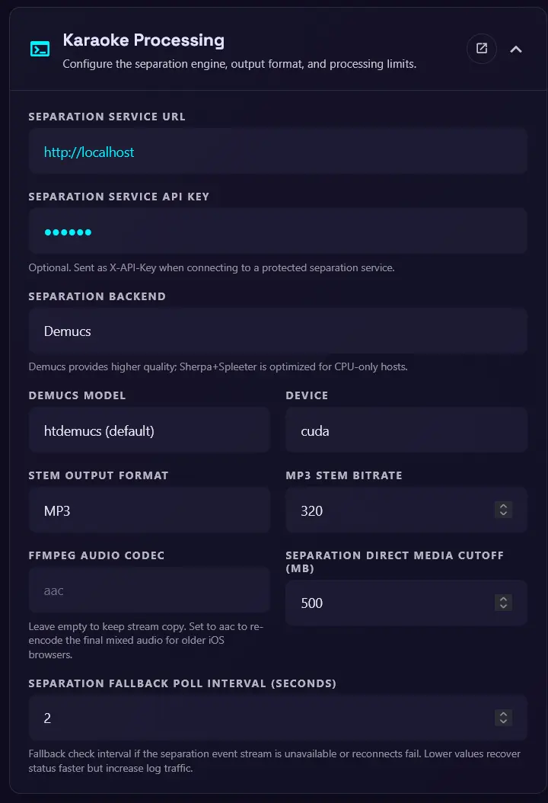

# Karaoke Processing

During karaoke processing, the main application sends audio, or the full video when appropriate, to the Demucs service for separation. The service produces a vocal track and an instrumental track. Both tracks are sent back to the main application, where FFmpeg merges the instrumental track with the original video and saves the vocal track separately. The main application uses SSE (server-sent events) to report Demucs progress.

Use this page to configure the separation engine, output format, and processing limits. These settings can also be set with [environment variables](environments.md) when a deployment needs fixed values.

{ width="400" }

## Demucs service

### Separation service URL

The URL of the Demucs service.

### Separation service API key

An optional API key for the Demucs service.

??? warning "API key strongly recommended for publicly exposed Demucs services"

    For users behind CG-NAT who share the Demucs service with a friend or family member, Cloudflare Tunnel or a similar service can expose Demucs to the main application. However, if the Demucs service is publicly exposed, anyone can use it, which is why an API key is strongly recommended. For setup details, see the [Demucs service environment variables](environments.md#demucs-service).

## Separation options

### Separation backend

Choose either `Demucs` or `Sherpa+Spleeter`.

### Demucs model

The model used for separation. The default is `htdemucs`, which balances quality and speed. Other models include:

- `htdemucs`: first version of Hybrid Transformer Demucs. Trained on MusDB + 800 songs. Default model.
- `htdemucs_ft`: fine-tuned version of htdemucs, separation will take 4 times more time but might be a bit better. Same training set as htdemucs.
- `htdemucs_6s`: 6 sources version of htdemucs, with piano and guitar being added as sources. Note that the piano source is not working great at the moment.
- `hdemucs_mmi`: Hybrid Demucs v3, retrained on MusDB + 800 songs.
- `mdx`: trained only on MusDB HQ, winning model on track A at the MDX challenge.
- `mdx_extra`: trained with extra training data (including MusDB test set), ranked 2nd on the track B of the MDX challenge.
- `mdx_q`, `mdx_extra_q`: quantized version of the previous models. Smaller download and storage but quality can be slightly worse.
- `SIG`: where SIG is a single model from the model zoo.

### Sherpa+Spleeter model

The default is `fp16`. Choose `int8`, `fp16`, or `fp32`. The `int8` model is the fastest and smallest, but may have lower quality than the `fp16` and `fp32` models.

### Device

The device used for separation. Choose `cuda` or `cpu`, depending on the Demucs service's capabilities.

- If `cuda` is selected but the Demucs service does not support it, or uses the CPU-only Sherpa+Spleeter backend, separation falls back to the CPU.

## Output options

### Stem output format

Choose `mp3` or `wav`. `mp3` is recommended for faster network transfer and smaller storage.

### MP3 stem bitrate

The bitrate for MP3 stem output. The default is `320`. Set this lower, such as `128–160`, if the network connection to Demucs is slow.

### FFMPEG audio codec

The audio codec used by FFmpeg to merge the instrumental track with the original video. The default is empty, which uses stream copy. Set this only if stage clients have trouble playing the merged video. For example, iOS devices support `aac`.

## Processing limits

### Separation direct media cutoff (MB)

If the media file size is below this value, the main application sends the video directly to Demucs without downloading or extracting the audio first. The default is `500`. Set this lower, such as `20–50`, if the network connection to Demucs is slow.

### Separation fallback poll interval (seconds)

The interval used to poll the Demucs service for progress updates when the SSE connection fails. The default is `1.0` second.
