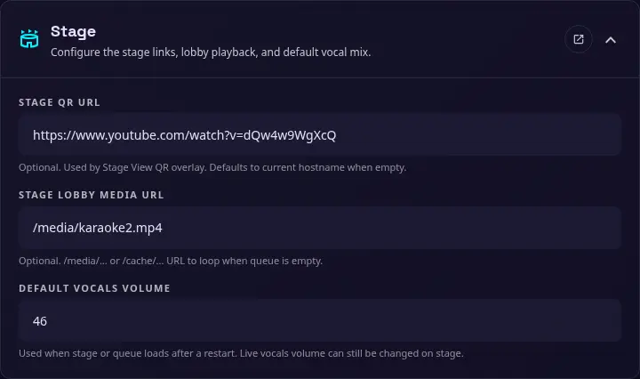

# Stage

{ width="400" }

Use this section to configure the Stage View QR destination, the empty-queue lobby media, and the default vocals volume. These settings can also be configured with [environment variables](environments.md) when a deployment needs fixed values.

### Stage QR URL

The optional URL encoded in the QR overlay shown in Stage View. When this is empty, the application uses the current hostname to build the destination.

### Stage Lobby Media URL

An optional media URL used for the lobby loop while the queue is empty. Use a `/media/...` URL, with the relative path to your media folder, such as `/media/stage-lobby.mp4`.

### Default vocals volume

The vocals volume applied when the Stage or Queue page loads after a restart. Enter a percentage from `0` to `100`. The live vocals volume can still be changed from the Stage page while it is running.

The equivalent `STAGE_VOCALS_VOLUME_DEFAULT` environment variable uses a decimal value from `0.0` to `1.0`; for example, `0.46` represents `46%`.
