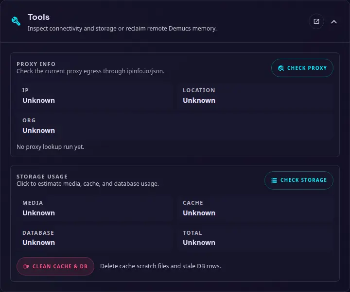

# Tools

{ width="400" }

Use this section to inspect the network and storage state with Check Demucs saving the current settings first. These actions are available only to administrators.

### Proxy info

Select **Check proxy** to inspect the current outbound connection through `ipinfo.io/json`. The result shows the detected IP address, location, and organization, which can help confirm whether a configured proxy is being used.

### Storage usage

Select **Check storage** to estimate the space used by media, cache files, and the SQLite database. The result also shows the combined total.

### Clean cache and database

Select **Clean cache & DB** to remove temporary cache files and stale database rows. This does not remove the media files in the configured media path, but review the result before relying on an item that may have been reported as missing.

### Check Demucs

Use this to check connectivity to the Demucs service after adding or modifying the Demucs URL or API key.

Check Demucs first saves the current settings form, including the URL and API key, then checks the saved service. If saving fails, no health request is sent.

### Run Demucs GC

Manually force a garbage collection cleanup on the Demucs service, unload all Demucs and WhisperX models to free up VRAM.
