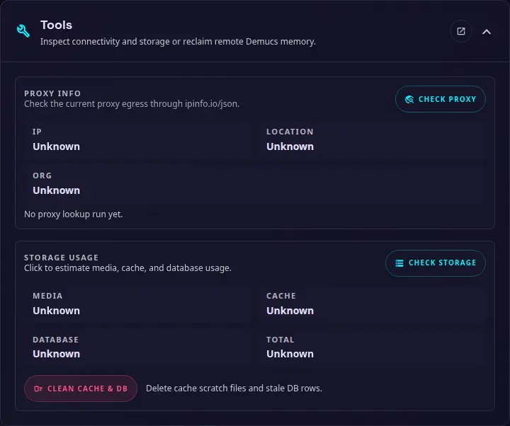

# Outils { #tools }

{ width="400" }

Utilisez cette section pour inspecter l'état du réseau et du stockage sans modifier la configuration principale de l'application. Ces actions ne sont disponibles que pour les administrateurs.

### Informations sur le proxy { #proxy-info }

Sélectionnez**Check proxy**pour inspecter la connexion sortante actuelle via `ipinfo.io/json`. Le résultat affiche l'adresse IP, l'emplacement et l'organisation détectés, ce qui peut aider à confirmer si un proxy configuré est utilisé.

### Utilisation du stockage { #storage-usage }

Sélectionnez**Vérifier le stockage**pour estimer l'espace utilisé par les médias, les fichiers de cache et la base de données SQLite. Le résultat indique également le total combiné.

### Nettoyer le cache et la base de données { #clean-cache-and-database }

Sélectionnez**Clean cache & DB**pour supprimer les fichiers de cache temporaires et les lignes de base de données périmées. Cela ne supprime pas les fichiers multimédias dans le chemin de média configuré, mais examine le résultat avant de vous fier à un élément qui peut avoir été signalé comme manquant.

### Vérifier Demucs { #check-demucs }

Utilisez cette option pour vérifier la connectivité au service Demucs après avoir ajouté ou modifié l'URL ou la clé API Demucs.

### Exécuter Demucs GC { #run-demucs-gc }

Forcer manuellement un nettoyage de collecte des ordures sur le service Demucs, décharger tous les modèles Demucs et WhisperX pour libérer de la VRAM.
