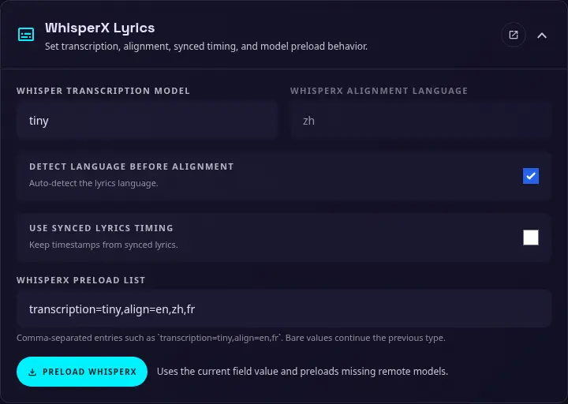

# WhisperX Lyrics

{ width="400" }

WhisperX creates word-by-word karaoke timing from plain-text or LRC lyrics. During processing, the main application sends the lyrics and separated vocal track to the Demucs service. WhisperX detects the language, aligns the lyrics with the vocals, and returns a JSON file containing fully synchronized lyrics.

Use this page to configure the WhisperX language and alignment workflow. These settings can also be set with [environment variables](environments.md) when a deployment needs fixed values.

### WhisperX transcription model

The transcription model used by WhisperX for language detection. The default is `tiny`, which is recommended because the backend does not need to transcribe the complete audio when the language is already known.

### WhisperX alignment language

The language that WhisperX uses for alignment. Enter a language code such as `en` or `zh`.

??? note "Choose between language detection and a fixed language"

    Enable language detection for a karaoke library containing songs in several languages. WhisperX can choose the appropriate alignment model, and automatic detection is usually easier for less-technical guests. Individual songs can override the detected language.

    If your library is primarily in one language, manually specify that language. This avoids unnecessary detection and the possibility of an inaccurate result selecting the wrong model and producing poor karaoke timing. When a language is specified manually, the language-detection transcription step can be skipped.

### Detect language before transcription

Enable this option to have WhisperX detect the audio language before alignment and select the appropriate model.

### Use synced lyrics timings

This option is disabled by default and is recommended to remain disabled. WhisperX can accept synced LRC lines, such as `[0:01.000] line`, which provide individual timestamps for each lyric line and can improve alignment speed.

However, lyrics from external sources are rarely synchronized with the video or audio used for karaoke. Using those timestamps can therefore result in worse word-level alignment quality.

### WhisperX preload list

The comma-separated list of WhisperX models to download and load in advance. The default is `transcription=tiny,align=en`. Entries use the format `type=model`, for example:

- `transcription=tiny`: preload the transcription model used for language detection.
- `align=en`: preload the English alignment model.
- `align=zh`: preload the Chinese alignment model.

The models must be downloaded before they can be used. The **Preload WhisperX** button downloads and loads the configured models in advance, before the first karaoke processing job.
