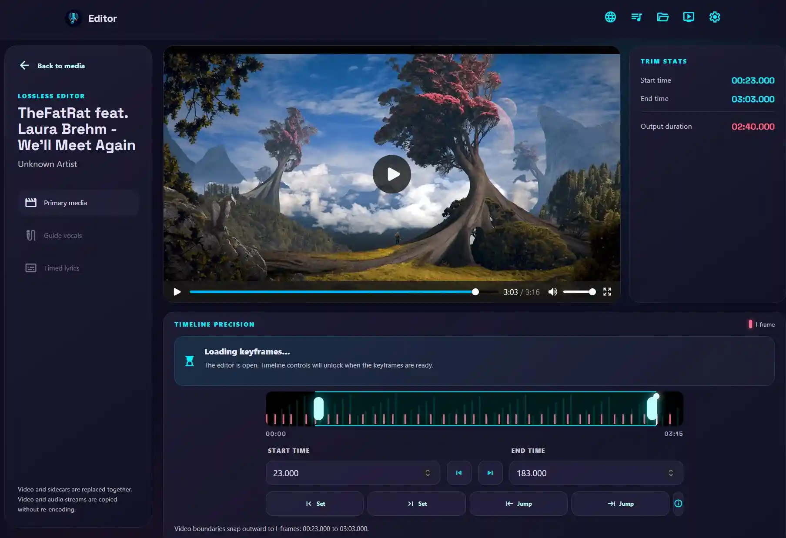

# Media Editing

The media editing tools are available to administrators from the media library's edit controls.

## Lossless Trimmer

{ width="600" }

Some karaoke songs may have long intros, branding, or reminder outros. Music videos may also contain sections without music. For the best karaoke experience, use the **Lossless Trimmer** to remove these sections.

When you use the lossless trimmer, attached sidecars such as lyrics and vocals are automatically trimmed to match. The trimmer uses I-frames (keyframes) to trim video almost instantly without re-encoding or reducing quality.

## Lyrics Editor

{ width="600" }

WhisperX output may not be perfect, and you may want to make minor adjustments to the lyrics. The **Lyrics Editor** converts WhisperX output into standard karaoke subtitle formats so you can adjust the timing with an external program. Two formats are supported: ASS and SRT.

- :material-subtitles:{ .lg .middle } __ASS format__

    ---

    ASS supports karaoke timing. Each line is converted to standard timing with `\k` tags and time codes.

    Edit ASS files with [Aegisub](https://aegisub.org/).

- :material-subtitles-outline:{ .lg .middle } __SRT format__

    ---

    SRT is a widely used subtitle format. Each word is converted into a subtitle line.

    Edit SRT files with [Subtitle Edit](https://www.nikse.dk/SubtitleEdit/).

## Add Vocals

{ width="600" }

It may be useful to add backing vocals to a premade karaoke video for practice. The **Add Vocals** feature lets you search YouTube or upload a full song, then extract its vocals with Demucs.

With a supported [vocal-sync](link to be added later) installation, the extracted vocals can be synchronized automatically with the original karaoke video. You can also adjust the vocal track timing manually to add or subtract a delay.
