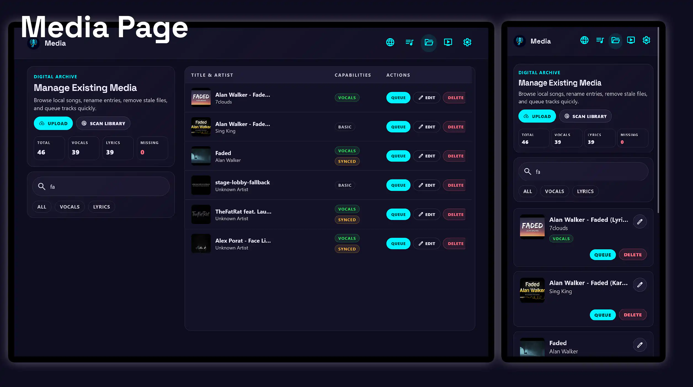
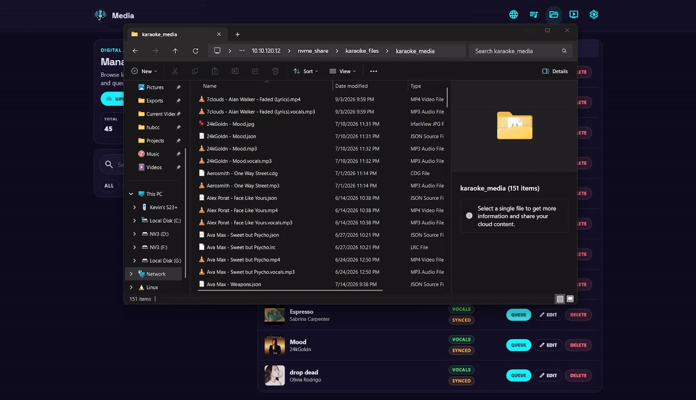

# Media Page

The media page is for managing apps library and modify downloaded songs, and upload new media.

## Highlights

-   

    __Manage media externally__

    Upload media through the app or externally.

    - Upload video and audio tracks through the app.
    - Run vocal separation and create karaoke from uploads.
    - Detect files and assets managed by other applications.
    - Quickly export media for backup or sharing.

-   

    __Create AI karaoke from existing media__

    Remove vocals and create karaoke lyrics from any existing media in the library.

    - No need to follow the YouTube download process.
    - Run vocal separation on existing tracks.
    - Search for lyrics to create precise karaoke timings.
    - Download, rename and delete sidecar files for karaoke.

-   

    __Upload autopilot__

    Default set of options which prepare the karaoke processing settings in one click.

    - Automatically infer track information based on the file name.
    - Automatically search and download lyrics for the track.
    - Autofill the title, artist and karaoke processing options.
    - Create optmized karaoke processing settings in one click before submitting.

## What you can do

-   :material-filter-variant:{ .lg .middle } __Search and filter for media__

    ---

    Search the entire library for songs and filter based on whether the track has vocals or synced lyrics.

-   :material-playlist-plus:{ .lg .middle } __Queue directly from media__

    ---

    Queue songs for playback while browsing the media library.

-   :material-refresh:{ .lg .middle } __Scan/update library__

    ---

    Detect changes in filesystem or individual songs and update the library accordingly.

-   :material-rename-box:{ .lg .middle } __Smart rename__

    ---

    Use LastFM to automatically infer track title and artist from YouTube titles.

-   :material-tune:{ .lg .middle } __Advanced options__

    ---

    Customize the parameters for WhisperX lyrics alignment options on existing media or uploads.

