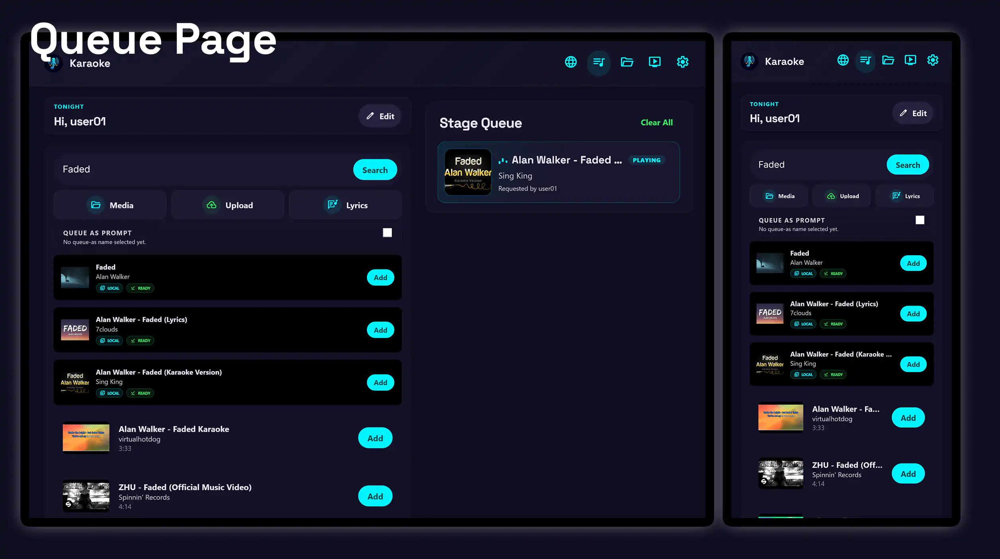
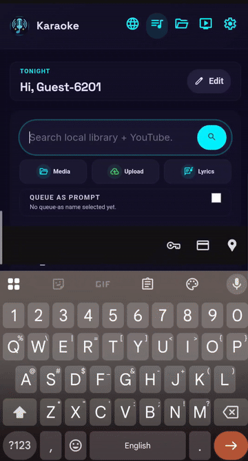
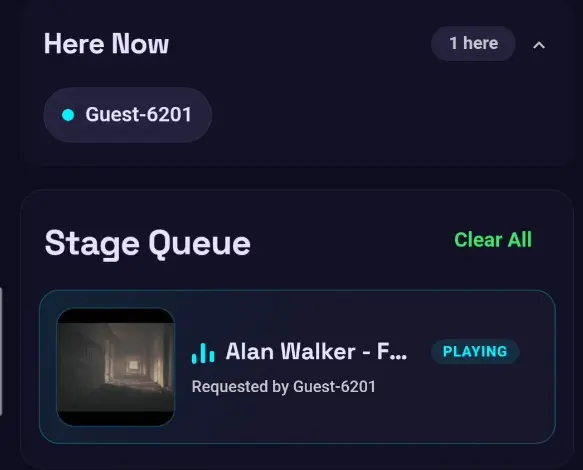
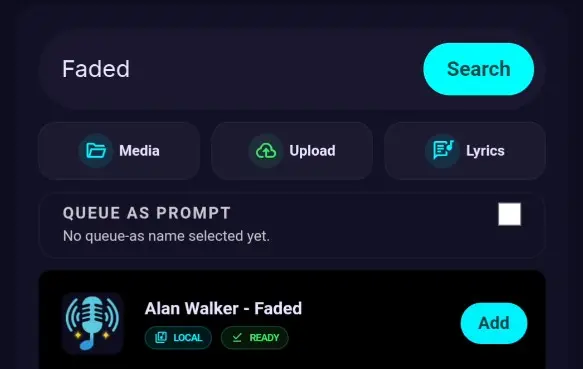
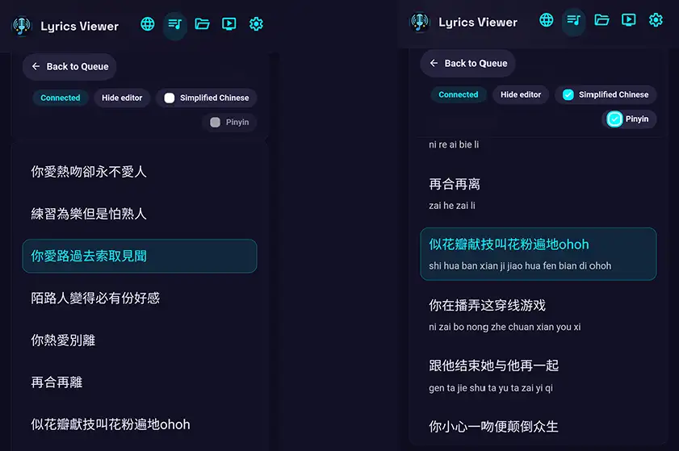

# Queue Page

The queue page is the main mobile/tablet control surface for the app.

## Highlights

-   

    __Control the stage__

    Play, pause, or seek the current media, and manage vocal backing tracks from the queue page.

    - Play, pause, skip, or seek the current media.
    - Apply shared lyric presets.
    - Change lyric text size, width, and background.
    - Enable or disable vocal backing tracks and adjust their volume.

-   { height="250" }

    __Queue controls__

    Search, add songs, and manage the active queue from a phone or tablet.

## What you can do

-   :material-account-plus:{ .lg .middle } __Join and queue as a guest__

    ---

    Choose a display name or use a generated name, see who is present, and add songs to the shared queue.
    

-   :material-magnify:{ .lg .middle } __Search local media and YouTube__

    ---

    Search the local library and YouTube in parallel. When enabled, the app also searches for both a song title and a karaoke version.
    

-   :material-remote:{ .lg .middle } __Control the stage__

    ---

    Play, pause, or seek the current media, and manage vocal backing tracks from the queue page.
    

-   :material-text-box-outline:{ .lg .middle } __Use the lyrics viewer__

    ---

    Read the current lyrics directly on the device, with an optional Pinyin view for Chinese lyrics.
    

-   :material-shield-account-outline:{ .lg .middle } __Use the right level of access__

    ---

    Guests can manage their own queued songs, while administrators can queue on behalf of another user and manage the full queue.

