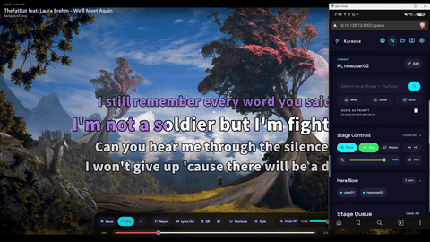
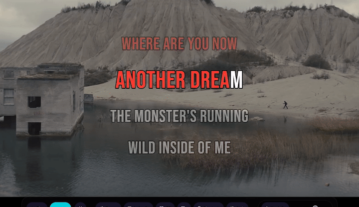
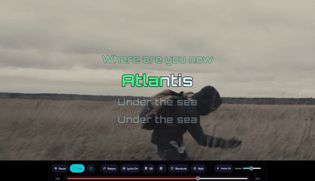

# 舞台显示 { #stage-display }

舞台显示会展示当前演出，并提供管理舞台的控制。

## 要点 { #highlights }

-   

    __实时控制__

    从舞台显示或队列页面控制当前演出。

    - 播放、暂停、跳过或查找当前媒体。
    - 应用共享的歌词预设。
    - 更改歌词文字大小、宽度和背景。
    - 启用或禁用伴唱人声轨道，并调整其音量。

-   

    __高级歌词样式定制__

    自定义歌词的外观和动画，打造更好的舞台体验。

    - 更改歌词的文字大小、宽度、颜色和背景。
    - 通过 Google Fonts 从数百种字体中选择字体。
    - 自定义逐字歌词的滚动动画。
    - 通过 JSON 轻松分享和重新创建歌词预设。

-   

    __键盘快捷键导航__

    使用键盘快速控制舞台显示，包括在 Zen 模式下使用时。

    - 调整人声、歌词和播放控制。
    - 显示和调整 QR 代码。
    - 在 Zen 模式下使用快捷键，无需屏幕上的控制按钮。

## 你可以做点什么 { #what-you-can-do }

-   :material-play-pause:{ .lg .middle } __控制播放__

    ---

    从舞台显示或队列页面播放、暂停、拖动进度或跳过当前媒体。

-   :material-fullscreen:{ .lg .middle } __使用 Zen 模式__

    ---

    隐藏所有控件，获得真正的全屏体验。

-   :material-qrcode:{ .lg .middle } __显示 QR 代码__

    ---

    允许来宾扫描舞台显示上的 QR 代码加入队列。

-   :material-sync:{ .lg .middle } __重新同步播放__

    ---

    修复人声与伴奏不同步的问题。

-   :material-microphone:{ .lg .middle } __调整伴唱人声轨道__

    ---

    启用或禁用伴唱人声轨道，并调整其音量。

-   :material-format-letter-case:{ .lg .middle } __创建和共享歌词预设__

    ---

    为不同歌曲和舞台显示创建、导入和导出歌词预设。

-   :material-disc:{ .lg .middle } __CDG 支持__

    ---

    播放包含音频和 CD 图形的 CDG 文件。

