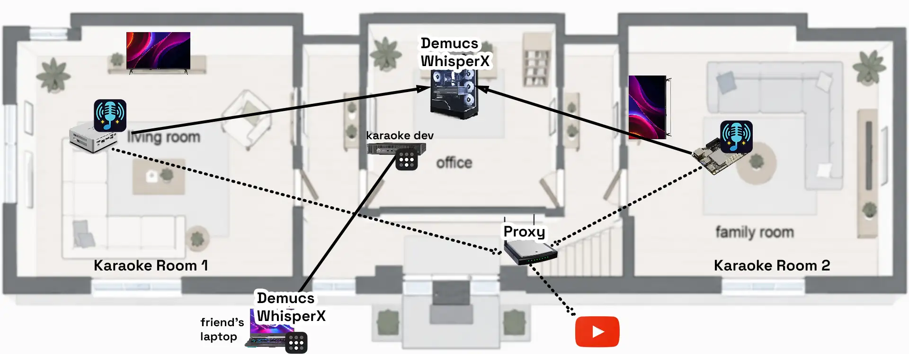

# Getting Started

DMKaraoke consists of two services.

- [Main application](#ways-to-deploy): a web server that provides queue, stage controls, and media management.
- [Demucs service](demucs-service.md): a separate application that runs WhisperX and Demucs for vocal separation and lyric generation.

This architecture gives users the flexibility to run the main application on a lightweight home server while using a more powerful machine for the Demucs service, including a friend's computer over the internet. The services communicate over HTTP, allowing one Demucs service to provide AI processing for multiple karaoke servers.

The recommended way to deploy the DMKaraoke main application is with Docker containers on a Linux server. Non-Docker installations, including bare-metal and LXC, as well as Windows installations, are also supported.

## Ways to Deploy

The main application is a lightweight FastAPI web server with a SQLite database. It can run on any x64 or ARM64 Linux server, including a Raspberry Pi 4 or an older office computer.

-   :material-docker: **Docker**

    Recommended for Linux servers.

    [:octicons-arrow-right-24: Open Docker guide](docker.md)

-   :material-linux: **Linux**

    Run the main application without Docker.

    [:octicons-arrow-right-24: Open Linux guide](linux.md)

-   :material-microsoft-windows: **Windows**

    Install the main application or Demucs service on Windows.

    [:octicons-arrow-right-24: Open Windows guide](windows.md)

### Demucs service

The Demucs service works best with a CUDA-enabled NVIDIA GPU. It can run without one, but processing will be slower. You can also run it on another computer.

- [Demucs Service](demucs-service.md)

## Production considerations

Back up your app data and media periodically, and upgrade when new versions are released. See [Backup, restore, and upgrade](backup-and-restore.md) for more information.

See [server administration](../tasks/server-administration.md) for more information about deploying DMKaraoke in production, including additional services such as proxy servers, reverse proxies, monitoring, and access control.
