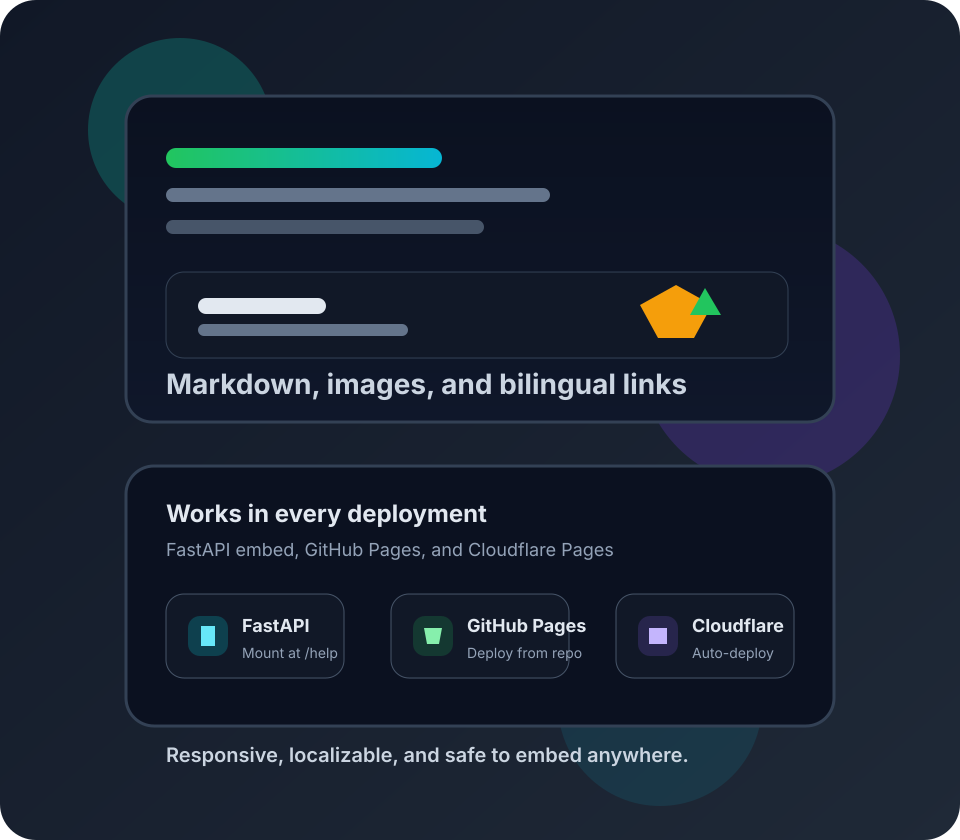

# 快速开始

这个示例文档集要在两种位置都能工作：

- 作为 FastAPI 的 `/help` 内嵌页面
- 作为 GitHub Pages 或 Cloudflare Pages 的独立静态站点

链接会保持相对部署路径，因此同一份构建产物可以直接移动到不同主机。

## 试试看

1. 打开 [点歌页面](../features/queue-page.md) 并沿着内部链接浏览。
2. 阅读 [制作 AI 卡拉 OK](../tasks/create-ai-karaoke.md) 了解一个简短流程。
3. 访问 [故障排查](../troubleshooting/index.md) 验证跨页面跳转。

## Markdown 特性

| 功能 | 示例 |
| --- | --- |
| 链接 | [点歌页面](../features/queue-page.md) |
| 回链 | [故障排查](../troubleshooting/index.md) |
| 图片 | 上方插图 |

> 这一页故意保持精简，方便先确认语言切换和资源路径都正常，再继续扩展内容。

