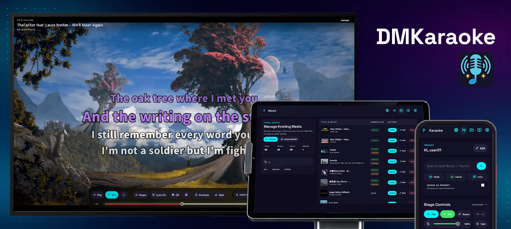

# Documentation DMKaraoke { #dmkaraoke-documentation }

Bienvenue dans la documentation pour l'application Demucs Karaoke. Si vous visualisez cette page dans l'application, vous pouvez retourner à l'application en cliquant sur le bouton ci-dessous.

[Retour à l'application Karaoke](../../../../demucs-karaoke-app){ .md-button }

## Bienvenue { #welcome }

DMKaraoke (Demucs Karaoke App) est une application web légère pour le karaoké à domicile. Elle utilise l'apprentissage automatique pour séparer les voix et créer des paroles synchronisées mot par mot. L'application est **complètement libre**, avec **no annonces** et **zero cloud frais d'abonnement**. Il crée karaoké sur votre propre appareil.

## Commencez ici. { #start-here }

- [Début](getting-started/overview.md)
- [Explorer les fonctionnalités](features/queue-page.md)
- [Configuration](configuration/settings.md)
- [Commencez à chanter](tasks/for-users.md)
- [Créer un karaoké AI](tasks/create-ai-karaoke.md)
- [Pour les administrateurs](tasks/for-users.md#for-administrators)
- [Dépannage](troubleshooting/index.md)
