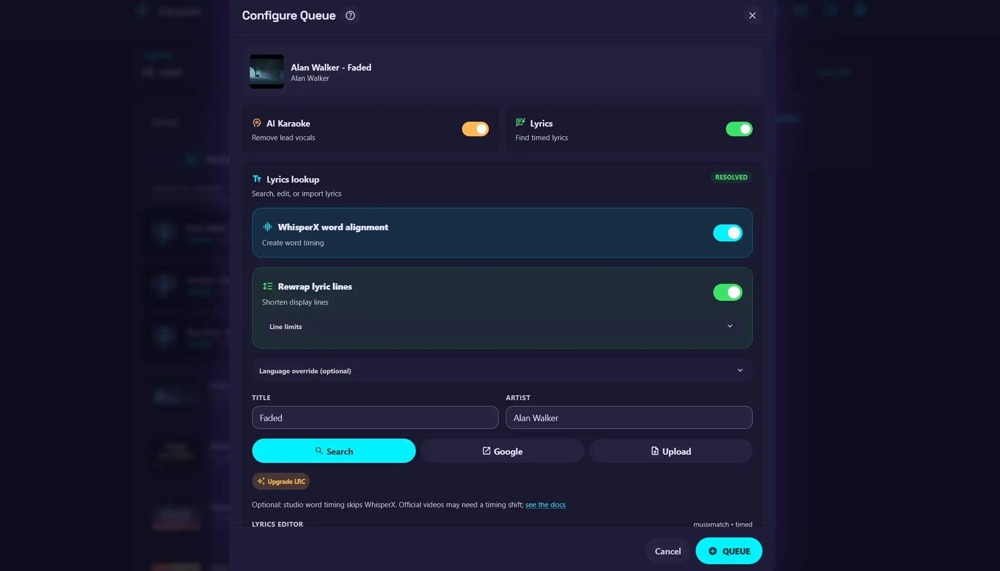
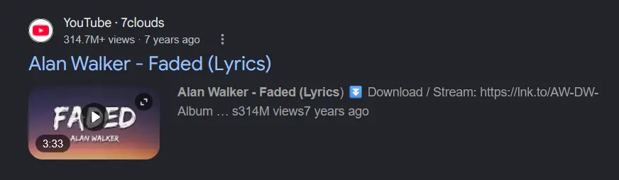
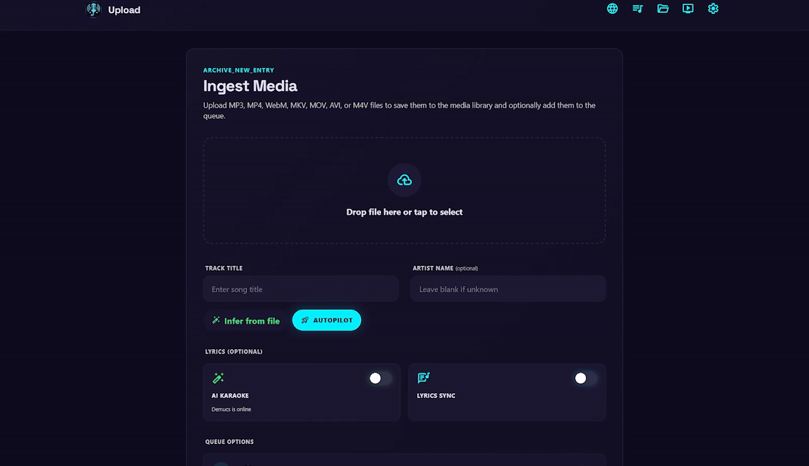
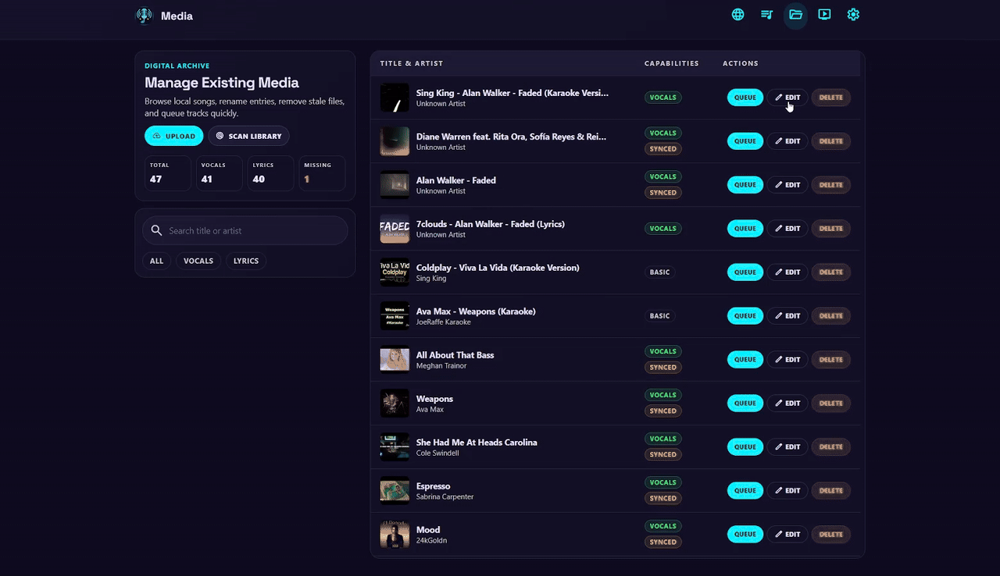
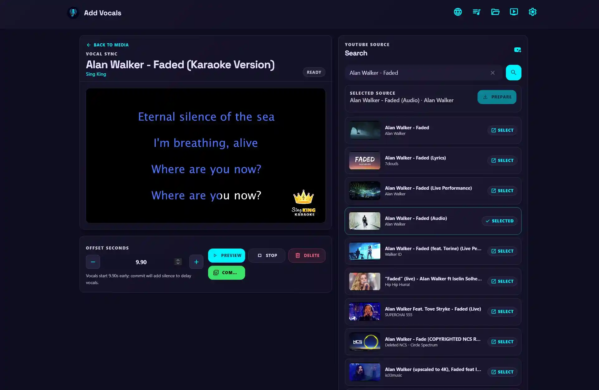

# Crear karaoke con IA

La aplicación ofrece varias formas de crear karaoke, desde descargar un vídeo musical hasta procesar tus propios archivos. Elige el flujo que mejor se adapte al material de origen y al nivel de procesamiento que quieras utilizar.

## Contenido

- [Crear karaoke a partir de un vídeo musical](#create-karaoke-from-a-music-video)
- [Crear karaoke a partir de un vídeo con letra](#create-karaoke-from-a-lyrics-video)
- [Crear karaoke a partir de archivos cargados](#create-karaoke-from-uploaded-files)
- [Modificar un vídeo existente](#modify-existing-video)
- [Añadir voces a un vídeo de karaoke ya preparado](#add-vocals-to-a-premade-karaoke-video)
- [Karaoke más rápido o de mejor resultado](#fastest-or-best-case-karaoke)

## Crear karaoke a partir de un vídeo musical { #create-karaoke-from-a-music-video }

Crear karaoke a partir de un vídeo musical ofrece la experiencia más envolvente y permite personalizar el estilo de las letras. También es la opción que más procesamiento requiere. Para procesar más rápido, utiliza el servicio Demucs en un equipo con GPU.

{ width="800" }

### 1. Selecciona un vídeo musical { #1-select-a-music-video }

1. Busca una canción y elige un vídeo musical en los resultados.
2. La aplicación no identifica automáticamente si el vídeo contiene letra o karaoke, por lo que activa tanto la separación de voces como el procesamiento de letras.

### 2. Configura las opciones de karaoke { #2-configure-karaoke-options }

La página previa a la cola ofrece estas opciones:

- **WhisperX word alignment** crea letras sincronizadas palabra por palabra para karaoke.
- **Reajustar líneas de letras** cambia el número máximo de caracteres por línea antes de pasar a la siguiente.
    - Para idiomas asiáticos, especialmente chino, japonés y coreano (CJK), ajusta `Max CJK Chars` en su lugar.
- **Language override** especifica el idioma de la [alineación de WhisperX](../configuration/whisperx-lyrics.md#whisperx-alignment-language). Al configurarlo se omiten la detección automática de idioma y cualquier idioma predeterminado configurado.

### 3. Añade la letra { #3-add-lyrics }

WhisperX necesita la letra para crear la temporización de karaoke. La aplicación busca en los proveedores de letras configurados.

- Primero usa Last.fm para deducir el título y el artista a partir del título del vídeo. Si el resultado no es correcto, escribe el título y el artista manualmente antes de buscar.
- El botón **Google** abre una pestaña nueva y busca `Artist - Title lyrics`. Copia el resultado en el **editor de letras**.
- También puedes cargar un archivo de letras `.lrc` o `.txt`.
- Edita la letra según sea necesario antes de añadir la canción a la cola de karaoke.

??? tip "Mejorar letras LRC"

    Algunas letras se pueden mejorar a TTML (Timed Text Markup Language), normalmente obtenido de Apple Music. TTML ya contiene letras sincronizadas palabra por palabra, puede proporcionar una temporización precisa para karaoke y evita el procesamiento de WhisperX.

    Si la mejora falla o devuelve una letra incorrecta, vuelve al resultado estándar de letras.

### 4. Procesa la canción { #4-process-the-song }

Después de añadir la canción a la cola, la aplicación descarga el material de origen, separa las voces, alinea la letra y prepara el contenido de karaoke para el escenario.

!!! note "Si falla el procesamiento"

    Si falla la descarga, consulta la [guía de solución de problemas de yt-dlp](../troubleshooting/index.md#yt-dlp-fails-to-download). Para problemas de separación de voces, consulta [La separación de voces es muy lenta](../troubleshooting/index.md#vocal-separation-is-very-slow). Para problemas de alineación o sincronización incorrecta de letras, consulta la [solución de problemas de alineación de WhisperX](../troubleshooting/index.md#whisperx-alignment-fails-or-takes-too-long) y la [solución de problemas de sincronización de WhisperX](../troubleshooting/index.md#whisperx-lyrics-are-poorly-synchronized).

## Crear karaoke a partir de un vídeo con letra { #create-karaoke-from-a-lyrics-video }

Los vídeos con letra están ampliamente disponibles en YouTube. Normalmente no incluyen letras sincronizadas palabra por palabra, pero pueden tener estilos visuales y fondos que algunos usuarios prefieren. También omiten la alineación de WhisperX, lo que reduce el tiempo de procesamiento en equipos que solo usan CPU.

### 1. Selecciona un vídeo con letra { #1-select-a-lyrics-video }

1. Busca una canción y elige un vídeo con letra en los resultados.
2. La aplicación detecta el vídeo con letra y activa únicamente la separación de voces, sin procesar las letras.

### 2. Espera a que termine la separación de voces { #2-wait-for-vocal-separation }

La canción necesita procesamiento de separación de voces. Aparecerá en el escenario al finalizar.

??? note "Los vídeos con letra no siempre están bien sincronizados"

    Los vídeos con letra suelen estar sincronizados por líneas y no por palabras. Además, a menudo priorizan los efectos visuales y las animaciones, por lo que las transiciones entre líneas pueden no coincidir exactamente con la música. Esto se nota menos cuando conoces bien la canción.

!!! note "Si falla el procesamiento"

    Si falla la descarga, consulta la [guía de solución de problemas de yt-dlp](../troubleshooting/index.md#yt-dlp-fails-to-download). Si la separación de voces falla o tarda demasiado, consulta [La separación de voces es muy lenta](../troubleshooting/index.md#vocal-separation-is-very-slow).

## Crear karaoke a partir de archivos cargados { #create-karaoke-from-uploaded-files }

Crear karaoke a partir de un MP3 cargado con carátula puede ofrecer una experiencia envolvente y personalizable. Cargar archivos también resulta útil cuando la aplicación no puede descargar un vídeo, cuando otro equipo o red es más adecuado para descargarlo o cuando quieres usar un archivo de tu propia biblioteca.

### 1. Carga un archivo { #1-upload-a-file }

Haz clic en el área de carga o arrastra y suelta un archivo en ella.

??? tip "Piloto automático de carga"

    El piloto automático prepara las opciones de karaoke predeterminadas con un clic:

    - Deduce la información de la pista a partir del nombre de archivo.
    - Busca y descarga letras.
    - Completa el título, el artista y las opciones de procesamiento de karaoke.
    - Crea ajustes de procesamiento de karaoke optimizados antes del envío.

### 2. Configura la canción cargada { #2-configure-the-uploaded-song }

Consulta [Crear karaoke a partir de un vídeo musical](#create-karaoke-from-a-music-video) para conocer las opciones de letras disponibles. Las mismas opciones están disponibles en el flujo de carga.

### 3. Elige dónde añadir la canción { #3-choose-where-to-add-the-song }

Activa **Añadir a la cola** para añadir la canción a la cola y mostrarla en el escenario al finalizar el procesamiento. Déjalo desactivado para añadir la canción procesada a la biblioteca y usarla más adelante.

!!! note "Si falla el procesamiento"

    Si la separación de voces falla o tarda demasiado, consulta [La separación de voces es muy lenta](../troubleshooting/index.md#vocal-separation-is-very-slow). Si la alineación de letras falla, tarda demasiado o produce una sincronización incorrecta, consulta la [solución de problemas de alineación de WhisperX](../troubleshooting/index.md#whisperx-alignment-fails-or-takes-too-long) y la [solución de problemas de sincronización de WhisperX](../troubleshooting/index.md#whisperx-lyrics-are-poorly-synchronized).

## Modificar un vídeo existente { #modify-existing-video }

La aplicación puede aplicar separación de voces y alineación de letras a contenido que ya está en la biblioteca.

### 1. Abre el editor de contenido { #1-open-the-media-editor }

1. Abre la página Multimedia y haz clic en **Editar** para el elemento.
2. En la página **Editar detalles multimedia**, modifica el título, el artista o las opciones de procesamiento de karaoke.
3. Usa **Automático** para deducir el título y el artista a partir del nombre de archivo mediante Last.fm.
    - Esto cambia el nombre en la biblioteca. Activa **Rename on disk** si también debe cambiar el nombre de archivo.

??? note "Cambiar el nombre en disco"

    El archivo solo cambia de nombre después de hacer clic en **Renombrar**. Si solo quieres modificar el título, el artista o el nombre de archivo sin procesar el contenido, no modifiques **Karaoke con IA** ni **Sincronización de letras**.

### 2. Configura las letras y el procesamiento { #2-configure-lyrics-and-processing }

Consulta [Crear karaoke a partir de un vídeo musical](#create-karaoke-from-a-music-video) para conocer las opciones de letras disponibles.

??? note "Lyrics Sync y WhisperX"

    Cuando solo está activada **Sincronización de letras** y se proporcionan letras, la aplicación guarda el archivo de letras sin ejecutar WhisperX. Edita de nuevo el contenido y activa **Alinear con WhisperX** cuando quieras crear letras sincronizadas.

!!! note "Si falla el procesamiento"

    Si la separación de voces falla o tarda demasiado, consulta [La separación de voces es muy lenta](../troubleshooting/index.md#vocal-separation-is-very-slow). Si la alineación de letras falla, tarda demasiado o produce una sincronización incorrecta, consulta la [solución de problemas de alineación de WhisperX](../troubleshooting/index.md#whisperx-alignment-fails-or-takes-too-long) y la [solución de problemas de sincronización de WhisperX](../troubleshooting/index.md#whisperx-lyrics-are-poorly-synchronized).

## Añadir voces a un vídeo de karaoke ya preparado { #add-vocals-to-a-premade-karaoke-video }

Si prefieres el estilo de letras de un vídeo de karaoke ya preparado, como uno de Sing King, pero quieres voces de apoyo para practicar, puedes usar la aplicación para añadir voces al vídeo.

??? tip "La alineación automática de voces requiere vocal-sync"

    La aplicación puede alinear automáticamente el instrumental de karaoke original con el instrumental separado del vídeo musical original si se cumplen los requisitos. Instala el [extra vocal-sync](../getting-started/linux.md#1-prepare-the-application-and-dependencies), o usa la [imagen Docker vocal-sync](../getting-started/docker.md#3-configure-the-environment), para activar la alineación automática de voces.

### 1. Abre Vocal Sync { #1-open-vocal-sync }

1. Abre la página Multimedia y haz clic en **Editar**.
2. Selecciona **Add Vocals** para abrir la página Vocal Sync.

### 2. Prepara y alinea las voces { #2-prepare-and-align-the-vocals }

1. Busca en YouTube o carga tus propios archivos y, después, haz clic en **Prepare**.
2. La aplicación separa las voces y el instrumental, y prepara una vista previa.
    - Cuando `vocal-sync` está disponible, el desplazamiento se calcula automáticamente.
3. Usa los botones **+** y **-** para ajustar el desplazamiento y haz clic en **Vista previa** para comprobar el resultado.
    - Un valor **+** retrasa las voces. Auméntalo si las voces empiezan antes que el instrumental.
    - Un valor **-** adelanta las voces. Redúcelo si las voces empiezan después que el instrumental.

??? note "Usa Preview para la reproducción"

    No uses los controles del reproductor de contenido para esta comprobación; solo reproducen el vídeo original. Usa **Vista previa** y **Detener** en su lugar.

### 3. Confirma el resultado { #3-commit-the-result }

Haz clic en **Commit** cuando la alineación sea satisfactoria.

## Karaoke más rápido o de mejor resultado { #fastest-or-best-case-karaoke }

Aunque no tengas una GPU compatible con CUDA para el servicio Demucs, puedes seguir usando las funciones de IA con CPU.

### Procesamiento con CPU { #cpu-processing }

Usa [Sherpa+Spleeter](../configuration/karaoke-processing.md#separation-backend) para la separación de voces.

- El servicio Demucs descarga los modelos según tu [configuración](../configuration/environments.md#processing-and-model-settings).
- Sherpa+Spleeter funciona bien con CPU y es considerablemente más rápido que Demucs.
- La calidad de separación no es tan buena como con Demucs.

### Mejora de letras TTML { #ttml-lyrics-upgrade }

No hay una alternativa sencilla a WhisperX que use solo CPU. Una canción típica de tres minutos puede tardar uno o dos minutos en separarse. Sin embargo, algunas canciones disponen de una mejora de letras TTML. TTML ya contiene letras sincronizadas palabra por palabra y omite el procesamiento de WhisperX.

Los tiempos de TTML son tiempos oficiales de letras musicales y normalmente coinciden con el lanzamiento original de la canción, no con una edición concreta del vídeo. No son adecuados para vídeos musicales con introducciones, finales u otras ediciones porque la letra puede desfasarse respecto al vídeo. Usa TTML para vídeos que no sean musicales y tengan la temporización de la canción original, o para MP3 cargados; usa WhisperX cuando el vídeo incluya secciones adicionales o modificadas.

Usar `Sherpa+Spleeter` con una mejora TTML proporciona la experiencia de karaoke más rápida y de mejor resultado en dispositivos que solo usan CPU.
