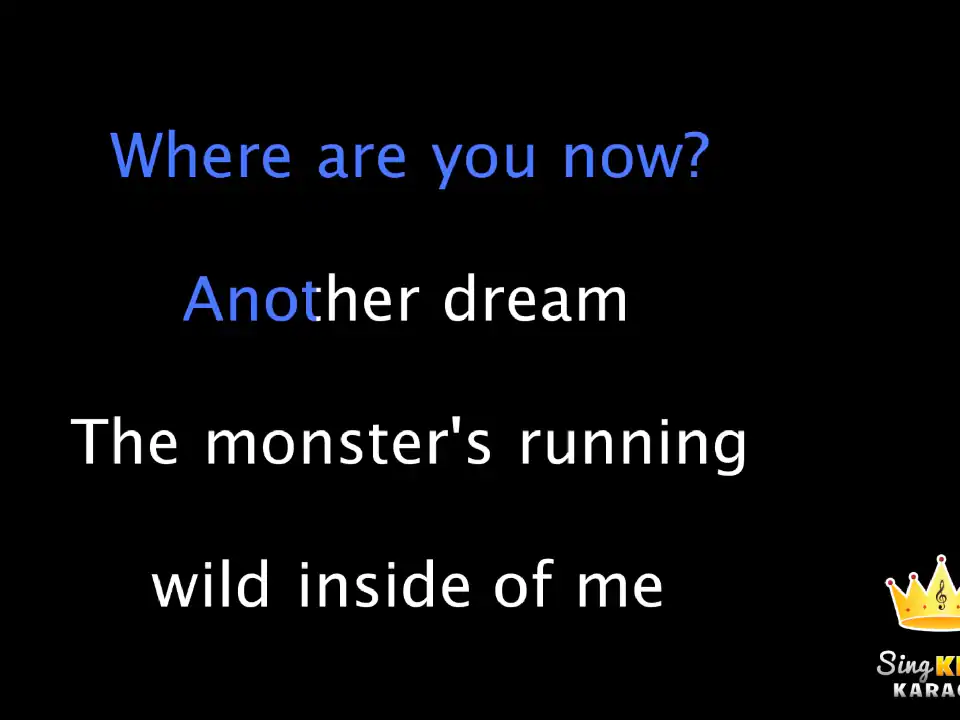
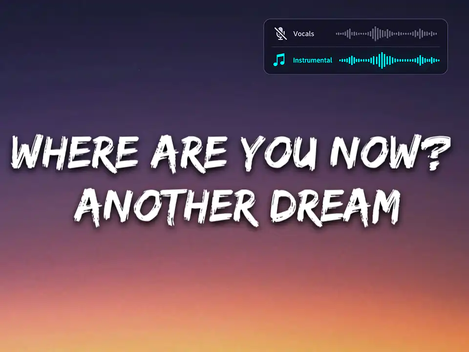

# For Users

This page covers the basics for guests joining a karaoke session.

## Join the karaoke session

1. Scan the QR code shown on the stage TV or projector.
2. If the QR code is not visible, ask the karaoke host to press ++q++ on the keyboard to display it.
3. Enter a nickname when prompted. The nickname identifies your song requests and helps distinguish you from other guests.

??? note "Getting an access denied error"

    The karaoke host may restrict access to the queue or provide a shared tablet instead. Please ask the host for help.

## Queue a song

There are several ways to queue a song. Choose the option that best matches the video or music you want to use.

-   

    **Standard YouTube karaoke**

    Queue a ready-made karaoke video without vocal separation or lyric alignment.

    [Queue a simple song](karaoke-tasks.md#queue-a-premade-karaoke-video)

-   

    **Lyrics video with vocal removal**

    Use a lyrics video and let the application remove the original vocals.

    [Queue a lyrics video](create-ai-karaoke.md#create-karaoke-from-a-lyrics-video)

-   

    **Immersive karaoke**

    Create a personalized karaoke track with vocal separation, synchronized lyrics, and the original music video or album art.

    [Queue a music video](create-ai-karaoke.md#create-karaoke-from-a-music-video)

You can also [upload your own music file](create-ai-karaoke.md#create-karaoke-from-uploaded-files) and add vocal separation and synchronized lyrics.

Take a moment to review the available queueing options. This will help you choose the right option for the type of YouTube video you found and understand what the application can do with it.

??? tip "Preview a video before queueing it"

    After searching, click the video title to open it in a new tab. Preview the video to check whether it already contains lyrics or vocals before choosing the processing options.

## For Administrators

Administrators can use the following pages to configure the stage, administer the server, and manage the media library:

- [Stage and Branding](stage-and-branding.md)
- [Server Administration](server-administration.md)
- [Media Administration](media-administration.md)

For more advanced queueing workflows, see [Karaoke Tasks](karaoke-tasks.md) and [Create AI Karaoke](create-ai-karaoke.md).
