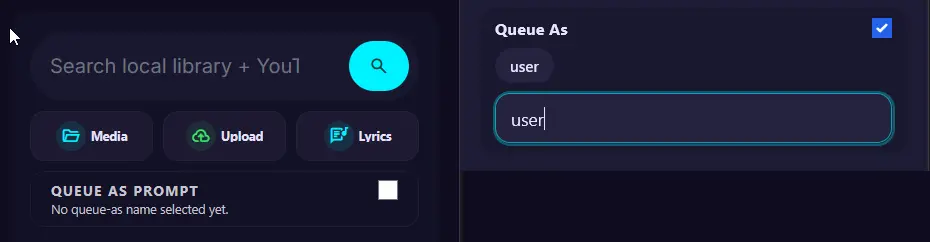
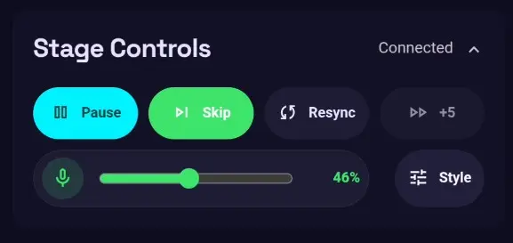

# 卡拉 OK 任务

- [将现成的卡拉 OK 视频加入队列](#queue-a-premade-karaoke-video)
- [以其他用户的身份将歌曲加入队列](#queue-a-song-as-another-user)
- [远程控制队列](#control-queue-remotely)
- [使用自己的歌曲](#use-your-own-song)

## 将现成的卡拉 OK 视频加入队列 { #queue-a-premade-karaoke-video }

YouTube 上有大量卡拉 OK 视频，例如 [Sing King](https://www.youtube.com/channel/UCwTRjvjVge51X-ILJ4i22ew) 等频道。热门歌曲通常已经有现成的卡拉 OK 视频，这是最简单的入门方式，**不需要 Demucs 服务**。不过，这种方式的卡拉 OK 风格和可定制程度比较有限。

- 搜索歌曲。通常只需搜索歌曲名和艺人名即可。
- 也可以直接将 YouTube URL 粘贴到搜索框中。

!!! tip "[并行 YouTube 搜索](../configuration/downloads.md#parallel-youtube-search)"

    启用并行 YouTube 搜索后，应用会同时搜索原始查询和卡拉 OK 变体，有助于找到现成的卡拉 OK 视频。

- 应用会自动识别卡拉 OK 视频，因此无需进行卡拉 OK 处理。将其加入队列，等待下载完成即可。
- 下载完成后，歌曲会加入队列，并显示在舞台上。

如果下载失败，请参阅 [yt-dlp 故障排除指南](../troubleshooting/index.md)。

## 以其他用户的身份将歌曲加入队列 { #queue-a-song-as-another-user }

通常，嘉宾使用自己的设备，并只能以自己的身份将歌曲加入队列。在共用平板电脑上，管理员可以登录并以其他用户的身份排队，这样不同用户的歌曲就能在同一台设备上加入队列。

- 启用**以提示的用户排队**开关。
- 像平常一样搜索歌曲。
- 在排队前页面选择已有用户，或输入新名称来排队。

## 远程控制队列 { #control-queue-remotely }

伸手操作舞台设备的键盘可能不方便。您可以使用自己的设备或共用设备实时控制屏幕。可用选项包括：

!!! note "嘉宾和管理员的控制权限"

    嘉宾可以管理自己排队的歌曲，管理员则可以代替其他用户排队并管理整个队列。

    管理员还可以删除或重新安排其他用户排队的歌曲。

- **暂停/播放**：暂停或继续播放当前歌曲。
- **跳过**：跳过当前歌曲。
- **重新同步**：修复人声与伴奏不同步的问题。
- **快进 5 秒**：将当前歌曲快进 5 秒。
- **人声**：打开或关闭人声伴奏轨道（仅支持的歌曲可用）。
- **人声音量**：调整人声音量（仅支持的歌曲可用）。
- **样式**：调整歌词的高级[自定义选项](stage-and-branding.md#customize-the-stage-display)（仅支持的歌曲可用）。

## 使用自己的歌曲 { #use-your-own-song }

如果您已经下载了卡拉 OK 视频，或者应用无法顺利完成下载，可以将自己的媒体上传到媒体库。

应用支持多种常见媒体格式：

- 视频：MP4、WEBM、MKV、MOV、AVI、M4V
- 音频：MP3、WAV、M4A、FLAC、AAC、OGG、OPUS、WEBM
- 其他：CDG（传统卡拉 OK 格式）、ZIP（应用导出的卡拉 OK 文件包）

-   **使用应用**

    - 打开媒体页面，点击**上传**。
    - 选择媒体文件，也可以填写标题和艺人。
    - 如需高级卡拉 OK 处理选项，请参阅[从上传文件创建卡拉 OK](create-ai-karaoke.md)。

-   **从外部导入**

    - 将媒体文件复制到主机上的 `MEDIA_PATH` 目录。
    - 如果服务器在远程运行，可以使用 `SCP/SFTP`（WinSCP 或 FileZilla）或 `SMB/NFS` 网络共享。
    - 在媒体页面点击**扫描媒体库**，检测新媒体。

