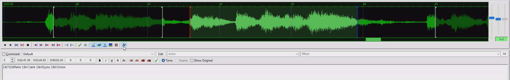
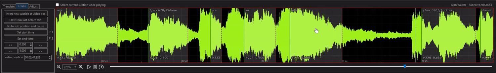
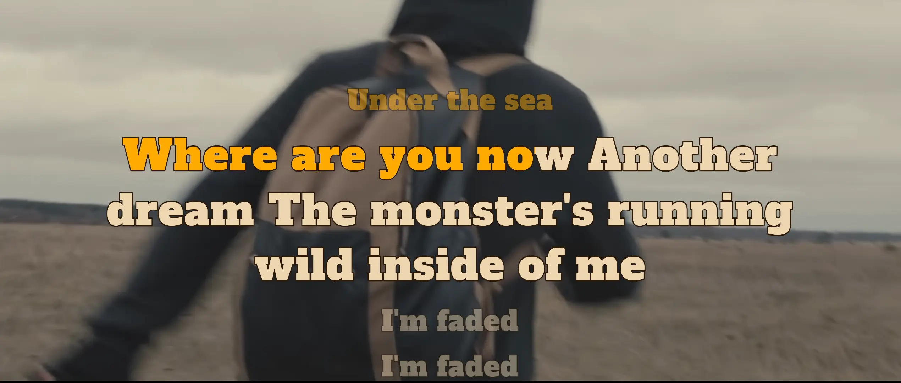
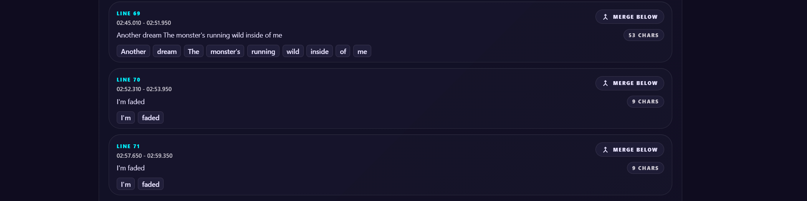

# Administration des médias { #media-administration }

Utilisez ce guide pour gérer les médias importés, réparer le timing lyrique, modifier les fichiers vidéo et convertir les formats CD+G karaoké.

## Sommaire { #contents }

- [Import and Export Media](#import-and-export-media)
- [Resynchronize Inaccurate WhisperX Lyrics](#resynchronize-inaccurate-whisperx-lyrics)
- [Adjust Video Duration and Metadata](#adjust-video-duration-and-metadata)
- [Modernize CD+G Formats](#modernize-cdg-formats)

## Importation et exportation des médias { #import-and-export-media }

Vous pouvez télécharger tous les artefacts créés par l'application pour l'utilisation du karaoké, y compris les chants séparés et les paroles de JSON synthétisées par mots.

1. Ouvrez `/media` et cliquez sur **Edit**.
2. Expand **Gestion des dossiers**.
3. Cliquez sur **Télécharger Zip** pour télécharger tous les artefacts, ou télécharger des fichiers individuels.
4. Supprimer les fichiers sidecar tels que les chants et les paroles quand ils ne sont plus nécessaires.

L’option **Download Zip** crée une archive des fichiers associés au média. Vous pouvez importer cette archive via `/upload` pour restaurer le média de karaoké à partir d’une sauvegarde.

Pour les médias gérés de l'extérieur, l'application s'attend à la convention de nommage de sidecar suivante :

- `<song>.mp4`: the main video file. When importing a vocal-separated video, the video should contain only the instrumental audio.
- `<song>.vocals.mp3`: the separated vocal audio.
- `<song>.json` or `<song>.lrc`: the word-synced or standard lyrics file. The JSON file is expected to be generated by WhisperX.

Exemple WhisperX JSON:

```json
{"segments":[{"start":0.0,"end":5.0,"text":"Hello, world!","words":[{"start":0.0,"end":2.5,"word":"Hello"},{"start":2.5,"end":5.0,"word":"world"}]}]}
```

??? note "Non-WhisperX JSON"

    Si le fichier JSON ne se conforme pas au format WhisperX ou est mal formé, il ne sera pas traité et les paroles ne fonctionneront pas.

    Copiez les fichiers dans le dossier `media`, puis analysez la bibliothèque pour détecter les nouveaux morceaux.

## Résynchroniser les lyriques WhisperX inexacts { #resynchronize-inaccurate-whisperx-lyrics }

??? note "Décalages de synchronisation importants"

    Si les paroles se déplacent rapidement et sont hors de synchronisation, WhisperX peut avoir détecté la mauvaise langue et utilisé le mauvais modèle pour l'alignement. Supprimez les paroles JSON existantes, puis exécutez l'alignement WhisperX à nouveau avec une surcharge de langue spécifiée manuellement.

    1. Sur la page de l'éditeur de médias, élargissez **Gestion de fichiers** et supprimez les paroles JSON.
    2. Activer **Lyrics Sync** à nouveau et allumer **WhisperX Align**.
    3. Spécifiez manuellement un code de langue dans **WhisperX Language Override**.

    For smaller synchronization issues, such as a word ending too early or lingering until the next chorus, you can refine the timing with third-party tools. Download the `.vocals.mp3` file as a timing reference. When you finish editing, upload the corresponding file and the server will process it back into JSON.

    

### SSA Karaoke Timing { #ssa-karaoke-timing }

L’application exporte un fichier de sous-titres `.ass` contenant les timings du karaoké. Vous pouvez utiliser [Aegisub](https://aegisub.org/) pour les ajuster, puis exporter un nouveau fichier `.ass`.

- [Karaoke Timing Tutorial](https://aegisub.org/docs/latest/karaoke_timing_tutorial/)
- [YouTube: Aegisub Lesson 10 - How to make a Karaoke Video](https://www.youtube.com/watch?v=4YTIaMeKXts)



1. Import the vocals and `.ass` file into Aegisub.
2. Activer **Karaoke Timing** pour modifier le timing au niveau du mot.
3. Désactivez-le pour modifier le timing en ligne.
4. Cliquez à gauche pour définir le point en et à droite pour définir le point de sortie pour une ligne.
5. Appuyez sur la barre d'espace pour prévisualiser le timing avec la voix.

Ce n'est pas un tutoriel complet d'Aegisub.

### Édition de mots SRT { #srt-word-editing }

L’application exporte également un fichier de sous-titres `.srt` avec des marqueurs temporels, chaque mot constituant une entrée distincte. Vous pouvez utiliser [Subtitle Edit](https://www.nikse.dk/SubtitleEdit/) pour ajuster les timings, puis exporter un nouveau fichier `.srt`.



1. Import the vocals and `.srt` file into Subtitle Edit.
2. Sous-titre Édition doit générer automatiquement la forme d'onde vocale.
3. Faites glisser l'heure de début et de fin de chaque mot pour changer son timing.

??? warning "Ne supprimez pas les lignes `//wx:meta` et `//wx:time`"

    Ces marqueurs de ligne sont nécessaires pour reconstruire les paroles synthétisées de mots.

### Lignes de séparation et de fusion { #split-and-merge-lines }



Parfois, les paroles originales contiennent de longues lignes qui ne se brisent pas proprement et apparaissent comme plusieurs lignes dans l'affichage du karaoké. Gardez le nombre de caractères par ligne de karaoké cohérent en ajustant la mise en page ou en recompilant les paroles.

You can partially fix this by [reducing the text size or increasing the maximum width](stage-and-branding.md#typography-and-layout).

Il y a deux façons de fixer les lignes :

1. Set **Rewrap Lyrics Lines** during WhisperX processing on the [Create AI Karaoke](create-ai-karaoke.md) page. The default is 36 characters per line for English and 12 for CJK. Choose a limit that works best with your lyric presets and customization.
2. Utilisez la division et fusionnez manuellement. Divisez une ligne longue au mot où elle circule le mieux, ou combinez plusieurs lignes plus petites.



1. Dans l'éditeur **Lyrics**, choisissez **Split et Merge** pour ouvrir l'éditeur split-and-merge.
2. Utilisez **Processus automatique** et spécifiez un **Longueur de ligne maximale** pour diviser automatiquement les lignes qui dépassent la limite.
3. Cliquez sur un mot pour diviser la ligne après ce mot.
4. Cliquez sur **Merge ci-dessous** pour combiner la ligne actuelle avec la ligne suivante.
5. Annule tout changement si nécessaire.

## Ajuster la durée et les métadonnées de la vidéo { #adjust-video-duration-and-metadata }

When a YouTube video is downloaded, it retains the default metadata: the title is the video title, the artist is blank, and the filename is `<video_title>.mp4`. This may not be ideal for library organization. The video is also downloaded as-is, and many karaoke videos contain intros and outros that are not suitable for seamless karaoke.

See [Modify Existing Video](create-ai-karaoke.md) for information about adjusting video metadata.

### Coupe sans perte { #lossless-trim }

??? note "Le rognage sans perte ne peut pas être parfaitement précis"

    L'application utilise des i-frames pour tailler la vidéo sans la re-encoder. Les coupes doivent donc se produire à un I-frame. Il n'est pas possible de tailler à un point précis; l'application trouve plutôt l'i-frame le plus proche.

??? warning "Rognage irréversible"

    Trimming est irréversible. Une fois la vidéo taillée, la vidéo originale est perdue.

    

    L'éditeur affiche une timeline avec tous les I-frames où une coupure peut se produire.

    - Faites glisser les poignées pour régler l'heure de début et de fin. Chaque poignée s'enclenche à l'image I la plus proche.
    - Spécifiez une heure de début et de fin dans les cases d'entrée. L'application choisit une image I qui inclut chaque heure spécifiée.
    - Play the video and use the **:material-rewind: Set** and **:material-fast-forward: Set** buttons to set the start and end points.
    - Use the **:material-rewind:** and **:material-fast-forward:** buttons to jump to the previous or next I-frame.
    - Use the **:material-rewind: Jump** and **:material-fast-forward: Jump** buttons to preview the cut from the in and out points.

??? tip "Accélérer la prévisualisation avec les raccourcis clavier"

    - ++i++ / ++o++ — définissez les points d'entrée et de sortie pour le parage
    - ++bracket-left++ / ++bracket-right++ — déplacer entre les images clés détectées
    - ++comma++ / ++période++ — déplacer la tête de jeu par un seul cadre
    - ++home++ / ++end++ — passer au début ou à la fin

## Moderniser les formats CD+G { #modernize-cdg-formats }

CD+G est un format de karaoké traditionnel qui affiche les paroles sous forme graphique. Il est généralement associé à un fichier MP3 dans un ensemble MP3+G. La scène peut lire les graphiques CD+G, mais il est impossible de [rogner](#lossless-trim) un fichier CD+G sans le convertir en vidéo.

Au lieu d'ouvrir l'éditeur sans perte pour un fichier CD+G, l'application vous invite à ouvrir **Transcoder en MP4**.

- Dans l'éditeur, transcodez les graphiques CD+G dans une vidéo MP4 avec l'audio MP3.
- Choisissez **Remplacez le fichier CD+G original après la création du MP4** pour créer un nouvel élément multimédia tout en préservant l'élément CD+G original.
