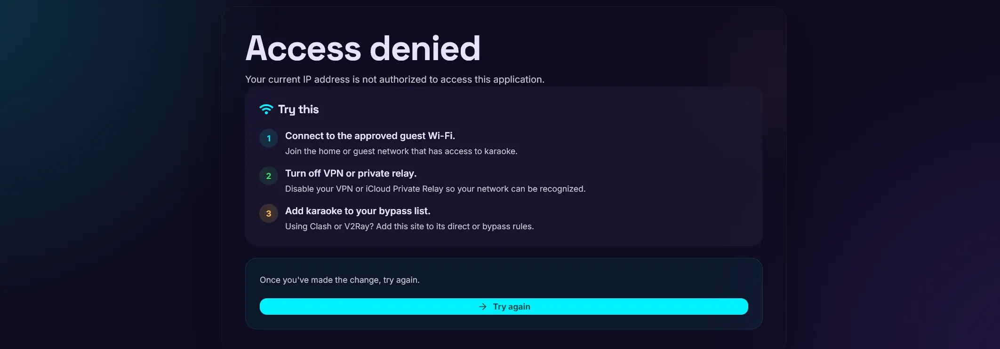
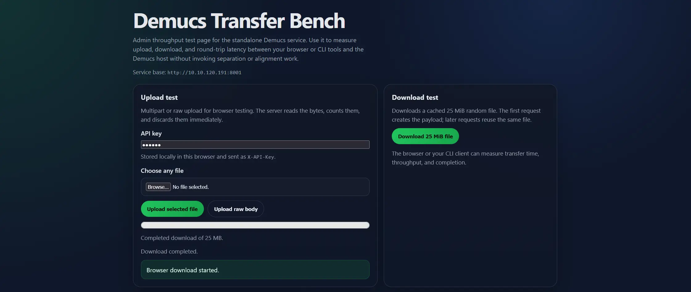
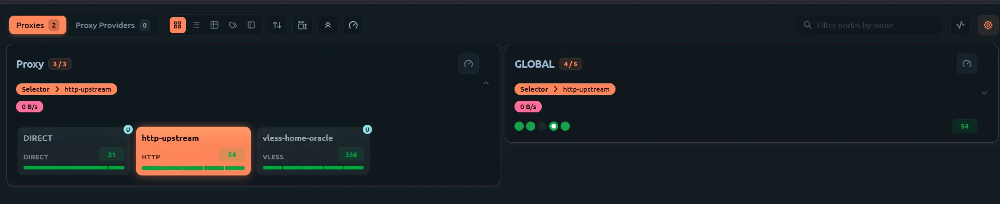
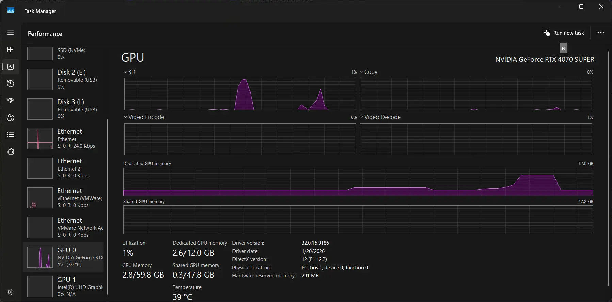

# 服务器管理

本页面介绍与网络相关的配置，包括限制访问、连接远程 Demucs 服务、通过代理路由下载流量，以及监控应用。

## 目录

- [限制访客 Wi-Fi 用户的访问](#restrict-access-to-guest-wi-fi-users)
- [公开远程 Demucs 服务](#expose-a-remote-demucs-service)
- [使用代理服务器下载](#use-a-proxy-server-for-downloads)
- [服务器监控](#server-monitoring)

## 限制访客 Wi-Fi 用户的访问 { #restrict-access-to-guest-wi-fi-users }

应用设计为在本地网络中运行。默认情况下，连接到同一网络的任何人都可以访问它。与其让嘉宾连接到个人电脑所在的局域网，不如使用大多数家用路由器（包括 ISP 提供的路由器）创建一个隔离的访客 Wi-Fi 网络。

访客 Wi-Fi 也可以帮助限制对卡拉 OK 应用的访问。嘉宾通过面向互联网的地址访问应用，而反向代理只允许来自家庭网络的请求。

??? note "需要公网 IP 地址和发夹 NAT"

    如果路由器不支持发夹 NAT，或者 ISP 使用 CGNAT，请改用[其他远程访问方式](#expose-a-remote-demucs-service)。

### 工作原理

1. 将 DNS 记录指向家庭网络的公网 IP 地址。
2. 配置反向代理，允许来自家庭子网的请求，拒绝其他 IP 地址。
3. 将嘉宾设备连接到隔离的访客 Wi-Fi 网络。

使用发夹 NAT 时，访客 Wi-Fi 发往公网 DNS 地址的请求会经由路由器或网关，再返回家庭网络。从反向代理的角度看，请求来自路由器，而路由器位于允许列表中。来自随机互联网用户的请求则会被拒绝。

对于家庭卡拉 OK 环境，这种方式可以提供清晰的访问边界，因为嘉宾必须身处获准的网络中才能访问应用。

### 配置访问受限页面

应用包含 `/access-restricted` 页面，可以向被拒绝的用户显示提示信息。您也可以配置反向代理显示自定义页面。



一般的反向代理配置应当：

- 允许家庭子网，拒绝其他所有 IP 地址。
- 将允许的流量转发到卡拉 OK 应用的 IP 地址和端口。
- 明确允许所有发往 `/access-restricted` 的请求，并将该路径转发给应用。
- 将反向代理生成的 `403` 响应重定向到 `/access-restricted`。

例如，在 Nginx Proxy Manager 中创建 Access List，添加 `192.168.0.0/24` 等家庭子网，允许该子网并拒绝其他地址，然后将列表应用到代理主机。

??? note "Nginx Proxy Manager 自定义 Nginx 配置"

    ```nginx
    location /access-restricted {
        allow all;
        proxy_pass http://<your-application-ip>:<your-application-port>;
        proxy_set_header Host $host;
        proxy_set_header X-Real-IP $remote_addr;
        proxy_set_header X-Forwarded-For $proxy_add_x_forwarded_for;
    }

    error_page 403 = @handle_403;

    location @handle_403 {
        # Replace with your destination URL or path.
        return 302 https://<your-karaoke-domain>/access-restricted;
    }
    ```

??? note "Caddy 配置"

    将主机名、应用地址和家庭子网替换为您自己的值。此示例允许所有人访问 `/access-restricted`，仅允许家庭子网访问应用的其他路径，并将其他客户端重定向到访问受限页面。

    ```caddyfile
    your-karaoke-domain.example {
        route {
            @access_restricted path /access-restricted*
            handle @access_restricted {
                reverse_proxy http://<your-application-ip>:<your-application-port>
            }

            @outside_home not remote_ip 192.168.0.0/24
            handle @outside_home {
                redir /access-restricted 302
            }

            handle {
                reverse_proxy http://<your-application-ip>:<your-application-port>
            }
        }
    }
    ```

    `remote_ip` 匹配器检查 Caddy 看到的源地址。如果 Caddy 前面还有其他代理或隧道，请先配置可信代理并确认客户端地址得到保留，再依赖此允许列表。

此配置会阻止家庭子网之外的所有 IP 地址。被拒绝的请求会收到 `403` 响应并重定向到 `/access-restricted`，而该路径仍对所有人可用。

### CGNAT 和其他网络方式

上述配置同时需要发夹 NAT 和公网 IP 地址。如果 ISP 使用 CGNAT，可以使用免费 VPS、[Tailscale Funnel 或 Cloudflare Tunnel](#expose-a-remote-demucs-service)处理反向代理和访问控制。当 WAN IP 地址发生变化时，可能还需要更新反向代理的允许列表。

## 公开远程 Demucs 服务 { #expose-a-remote-demucs-service }

您可以使用朋友带 GPU 的电脑运行 Demucs 服务，也可以与朋友共享自己的 GPU。卡拉 OK 应用必须能够连接到远程 Demucs 服务；Cloudflare Tunnel 和 Tailscale 都可以提供这种连接。

性能很大程度上取决于双方的互联网连接。如果 Tailscale 连接使用中继，处理速度可能会变慢。请使用 Demucs 的 `/transfer` 测速页面检查上传和下载性能，然后相应调整[分离直传媒体阈值](../configuration/karaoke-processing.md#separation-direct-media-cutoff-mb)。



### Cloudflare Tunnel

!!! warning "保护公开访问的 Demucs 服务"

    Demucs 服务暴露在互联网上时，强烈建议使用 API 密钥。在 [Demucs 服务](../configuration/environments.md#service-paths-and-access)和[卡拉 OK 应用](../configuration/karaoke-processing.md#separation-service-api-key)中配置相同的密钥，然后使用[检查 Demucs](../configuration/tools.md#check-demucs)测试连接。

如果临时随机主机名已经够用，Cloudflare Tunnel 无需注册域名即可使用。使用自己的域名则需要由 Cloudflare 管理的域名和额外的隧道配置，请参阅 [Homelab Haven 的 Docker Cloudflare Tunnel 教程](https://homelabhaven.com/posts/remote-access-2-cloudflare-tunnel-docker/)。

### 安装 `cloudflared`

请从官方 [Cloudflare 下载页面](https://developers.cloudflare.com/tunnel/downloads/)获取最新的软件包和二进制文件。以下示例会安装连接器；您仍然需要创建命名隧道，并在 Cloudflare 中配置主机名和源站。

=== "Windows"

    1. 从 [Cloudflare 下载页面](https://developers.cloudflare.com/tunnel/downloads/)下载 64 位 MSI 或可执行文件。
    2. 如果下载的是可执行文件，请将其重命名为 `cloudflared.exe`，并放入 `PATH` 中的目录，例如 `C:\Cloudflared\bin`。
    3. 打开 PowerShell，验证安装：

        ```powershell
        cloudflared.exe --version
        ```

    Windows 安装不会自动更新。需要时请手动下载新版本。

=== "macOS"

    使用 [Homebrew](https://brew.sh/) 安装：

    ```bash
    brew install cloudflared
    cloudflared --version
    ```

    创建命名隧道后，如果要将连接器安装为 macOS 服务，可以使用 `cloudflared service install` 安装登录代理，或使用 `sudo cloudflared service install` 安装 LaunchDaemon。

=== "Linux"

    在 Debian 或 Ubuntu 上，从 Cloudflare 软件包仓库安装：

    ```bash
    sudo mkdir -p --mode=0755 /usr/share/keyrings
    curl -fsSL https://pkg.cloudflare.com/cloudflare-main.gpg \
      | sudo tee /usr/share/keyrings/cloudflare-main.gpg >/dev/null
    echo "deb [signed-by=/usr/share/keyrings/cloudflare-main.gpg] https://pkg.cloudflare.com/cloudflared any main" \
      | sudo tee /etc/apt/sources.list.d/cloudflared.list
    sudo apt-get update
    sudo apt-get install cloudflared
    cloudflared --version
    ```

    对于基于 RPM 的发行版、Arch Linux 或直接下载二进制文件，请使用[官方安装说明](https://developers.cloudflare.com/tunnel/downloads/)。创建命名隧道后，可以使用 `sudo cloudflared service install` 安装 systemd 服务。

=== "Docker"

    拉取官方镜像并验证：

    ```bash
    docker pull cloudflare/cloudflared:latest
    docker run --rm cloudflare/cloudflared:latest version
    ```

    对于远程管理的隧道，请从 Cloudflare 控制面板复制安装命令。以下是基于令牌的 Compose 示例：

    ```yaml
    services:
      cloudflared:
        image: cloudflare/cloudflared:latest
        restart: unless-stopped
        command: tunnel --no-autoupdate run --token ${TUNNEL_TOKEN}
    ```

### 创建并运行隧道

1. 在 Cloudflare 控制面板中打开**网络 → 隧道**，创建隧道并选择 `cloudflared`。
2. 添加公共主机名，并将其指向本地源站，例如卡拉 OK 应用使用 `http://<your-application-ip>:8000`，Demucs 使用 `http://<your-demucs-ip>:8001`。
3. 运行连接器，命令为：

    ```bash
    cloudflared tunnel --no-autoupdate run --token <TUNNEL_TOKEN>
    ```

4. 使用 API 密钥保护 Demucs 端点，并在两个服务中配置相同的密钥。

??? note "快速隧道仅用于测试"

    快速隧道会创建随机的 `trycloudflare.com` 主机名，无需 Cloudflare 账户。它适合进行短时间的连通性测试，但不适合生产环境中的卡拉 OK：Cloudflare 文档说明其并发请求数上限为 200，并且不支持服务器发送事件（Server-Sent Events）。

    ```bash
    cloudflared tunnel --url http://localhost:<port>
    ```

!!! warning "Cloudflare CDN 上传限制"

    Cloudflare CDN 对文件上传有 **100 MB 的硬性限制**。请将[分离直传媒体阈值](../configuration/karaoke-processing.md#separation-direct-media-cutoff-mb)设置为 `100` MB 或更低，否则较大视频文件的卡拉 OK 处理会失败。

### Tailscale

Tailscale 会在卡拉 OK 应用和远程 Demucs 服务之间创建网状网络。当 Demucs 主机属于其他人时，可以[与其他用户共享您的机器](https://tailscale.com/docs/features/sharing)。

1. 在两台机器上安装 [Tailscale](https://tailscale.com/download)。
2. 登录同一账户，或加入同一个 tailnet。
3. 在管理控制台中查找 Demucs 服务的 Tailscale IP 地址，或运行 `tailscale status` 查找。
4. 将应用的[分离服务 URL](../configuration/karaoke-processing.md#separation-service-url)设置为 Demucs 服务的 Tailscale IP 地址和端口。
5. 测试连接，并运行 Demucs `/transfer` 测速。

Tailscale 在直连时效果最好。请参阅[连接类型指南](https://tailscale.com/docs/reference/connection-types#home-and-small-office-networks)和[防火墙指南](https://tailscale.com/docs/integrations/firewalls#firewall-compatibility-and-workarounds)，以改善直连情况。

## 使用代理服务器下载 { #use-a-proxy-server-for-downloads }

应用支持使用[代理服务器](../configuration/downloads.md#yt-dlp-proxy-url)从 YouTube 下载视频。当家庭网络暂时被 YouTube 屏蔽或受到速率限制时，代理可能会有所帮助。

如需更复杂的路由，可以使用 [Mihomo 与 metacubexd](https://github.com/metacubex/metacubexd) 等控制面板添加、管理和切换多个代理服务器。



### 简单的 SOCKS5 代理

Cloudflare WARP 是创建代理的一种方式。[warproxy Docker 镜像](https://github.com/kingcc/warproxy)可以将 Cloudflare WARP 转换为 SOCKS5 出口代理。

使用以下命令测试本地 SOCKS5 代理：

```bash
curl -4 -x socks5://localhost:1080 https://ifconfig.me
# A Cloudflare WARP proxy should return a 104.x.x.x IPv4 address.
```

如需将商业 VPN、WireGuard 或 OpenVPN 端点转换为 SOCKS5 代理，请参阅 [gluetun](https://github.com/passteque/gluetun) 及其 [HTTP 代理配置](https://github.com/qdm12/gluetun-wiki/blob/main/setup/options/http-proxy.md)。

### Mihomo 和 metacubexd

应用目前支持配置一个代理服务器，不提供代理切换或负载均衡。Mihomo 可以提供这些功能，而无需修改卡拉 OK 应用的代理设置。

为 Mihomo 配置 HTTP 代理入站，然后通过其控制面板添加和管理多个上游代理服务器。

??? note "Mihomo 和 metacubexd 基本配置"

    Docker Compose 配置示例：

    ```yaml
    services:
      metacubexd:
        image: ghcr.io/metacubex/metacubexd-server:latest
        restart: unless-stopped
        environment:
          CONTROL_TOKEN: change-me-control
          CLASH_SECRET: change-me-clash
          CONTROL_PORT: "8080"
          CLASH_API_PORT: "9090"
          MIXED_PORT: "7890"
          TZ: Asia/Shanghai
        ports:
          - "8080:8080" # Dashboard UI and control agent API.
          - "9090:9090" # Mihomo Clash API and WebSocket.
          - "7890:7890" # Mixed proxy port.
        volumes:
          - metacubexd-data:/data

    volumes:
      metacubexd-data: {}
    ```

    查看 [Mihomo 配置](https://wiki.metacubex.one/en/config/)并添加代理服务器。一个基本示例是：

    ```yaml
    external-controller: 0.0.0.0:9090
    secret: change-me-clash
    mixed-port: 7890
    allow-lan: true
    mode: rule
    log-level: info
    ipv6: false
    proxies:
      - name: Proxy1
    ```

    打开 `http://<your-server-ip>:8080`，使用 `change-me-clash` 访问控制面板。使用此配置前，请替换所有示例密钥。

配置代理后，如果 yt-dlp 下载失败，可以从 metacubexd 控制面板切换到其他代理服务器。无需修改卡拉 OK 应用的代理设置。

## 服务器监控 { #server-monitoring }

对于主应用，可以通过检查日志来识别问题或配置错误。

如果在前台或 tmux 会话中使用 `uvicorn` 运行应用，日志会显示在终端中。

对于使用 systemd 的 Linux，运行：

```bash
sudo journalctl -u your-karaoke-service-name -f
```

对于 Docker，运行：

```bash
docker logs -f your-karaoke-container-name
# Or: docker compose logs -f
```

应用还会记录具体的 `yt-dlp` 下载命令，有助于追踪下载失败的原因。

对于 Demucs 服务，相关的 Demucs 和 WhisperX 日志会显示在终端中。例如：

```text
2026-09-12 14:43:34 - whisperx.asr - INFO - No language specified, language will be detected for each audio file (increases inference time)
2026-09-12 14:43:34 - whisperx.vads.pyannote - INFO - Performing voice activity detection using Pyannote..
2026-09-12 14:43:39 - whisperx.asr - INFO - Detected language: en (0.88) in first 30s of audio
started inference
Inference time for segment 0: 0.78 seconds
```

Demucs 服务还提供 `/metrics` 端点，您可以使用外部工具监控该端点。

```json
{"service":"demucs","snapshot_at":"2026-09-12T21:58:47.346862+00:00","active_job_count":0,"running_job_count":0,"active_job_counts_by_status":{},"active_job_counts_by_kind":{},"free_vram_bytes":11013193728,"total_vram_bytes":12878086144,"last_gc_at":"2026-09-12T21:48:58.140879+00:00","last_gc_mode":"full","last_gc_detail":"Released WhisperX caches and CUDA memory","active_jobs":[]}
```

在 Windows 上，监控应用或调试卡住的任务，最好的方式是使用任务管理器，检查 GPU 图表中的 VRAM 和 GPU 使用率。



手机无法运行任务管理器。遇到这种情况，请使用 [RustDesk](https://rustdesk.com/) 远程访问 Windows 桌面。
