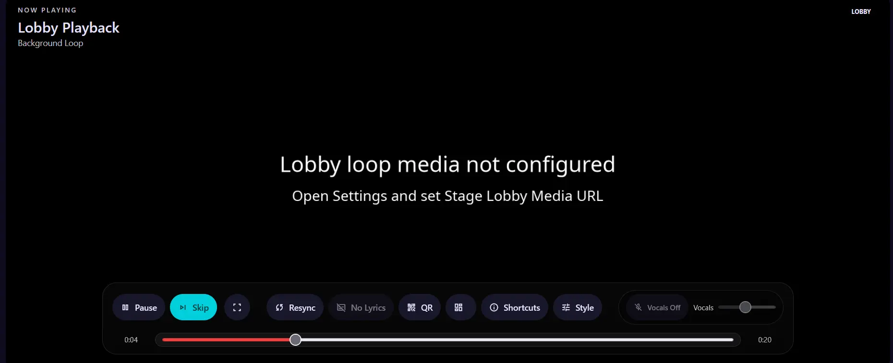
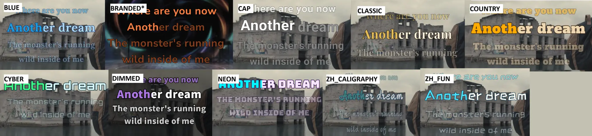
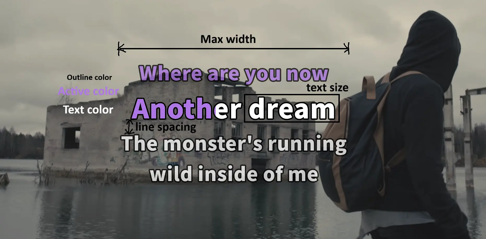
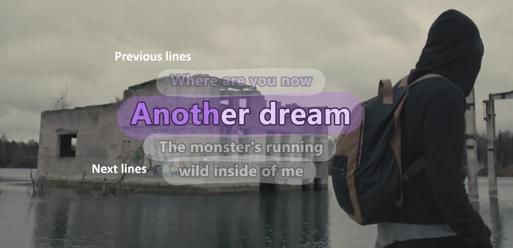
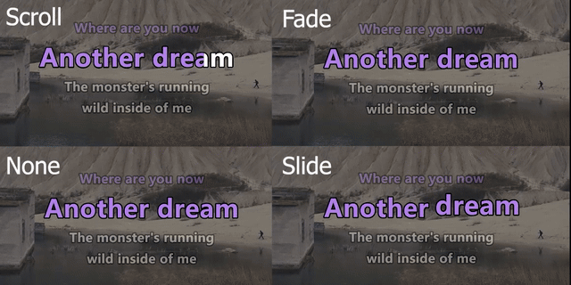
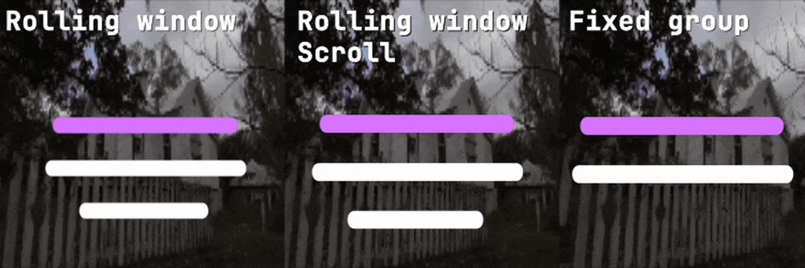
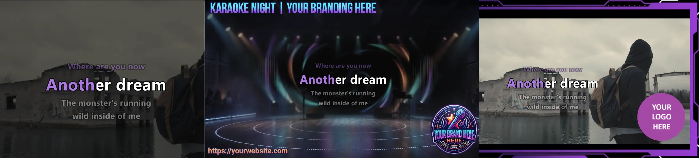
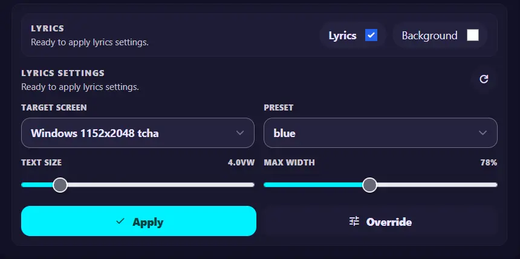

# Stage & Branding

This page explains how to configure the stage for guests, customize the lyrics display, manage branding media and presets.

## Contents

- [Configure the stage](#configure-the-stage)
- [Customize the stage display](#customize-the-stage-display)
- [Custom branding](#custom-branding)
- [Lyric presets](#lyric-presets)
- [Modify lyrics from Queue Control](#modify-lyrics-from-queue-control)
- [Use an iPhone or iPad as a stage display](#use-an-iphone-or-ipad-as-a-stage-display)

## Configure the stage

### 1. Configure the stage QR code

To provide a seamless experience for guests, configure a QR code with a URL that their devices can access. A [reverse proxy with access control](server-administration.md#restrict-access-to-guest-wi-fi-users) can be useful when the queue should not be publicly available.


1. Configure the [QR code URL in Settings](../configuration/stage.md#stage-qr-url).
2. On the `/stage` page, press ++q++ on the keyboard to display the QR code on the stage screen.
3. Press **+** or **-** to adjust the QR code size.

### 2. Configure the stage lobby

When the queue is empty, the application displays a default karaoke lobby with a looping video and tone. Replacing it with your own lobby media can make the stage feel more personal.



Configure the [stage lobby media URL in Settings](../configuration/stage.md#stage-lobby-media-url).

Here are two ways to create or choose lobby media:

<div class="grid cards" markdown>

-   __Download a video from YouTube__

    ---

    Follow [Queue a premade karaoke video](karaoke-tasks.md#queue-a-premade-karaoke-video) to download a video to the library.

    - You can [rename the video](create-ai-karaoke.md), for example to `stage-lobby.mp4`, for easy reference.

-   __Create a video with Remotion__

    ---

    [Remotion](https://www.remotion.dev/) is a framework for creating videos programmatically. It is AI-agent-friendly and easy to set up compared with professional video editors.

</div>

## Customize the stage display

The stage display provides extensive lyrics customization options. After installing the default presets, choose one as a starting point and adjust it to match your venue.



!!! note "Stage lyrics require fullscreen mode"

    To avoid distracting controls on the stage, lyrics are displayed only when the stage is in fullscreen mode.

You can ask an AI assistant to generate a custom preset JSON file. Use the following prompt as a starting point:

??? tip "Copy-and-paste AI prompt"

    ```text
    You are a creative designer for a karaoke stage display. Generate one complete,
    valid JSON object for a custom lyrics preset. The design brief is:

    [Describe the venue, mood, audience, colors to use or avoid, and whether the
    lyrics will often be Chinese, Latin-script, or mixed.]

    Prioritize visual aesthetics and projected-screen legibility: choose a cohesive
    font, color scheme, typography weight, spacing, line hierarchy, and outline
    that still read clearly over a moving music video. Make the active lyric color
    visually distinct without using low-contrast combinations. Use restrained
    neighbor-line opacity and scale so the current line is obvious from a distance.

    Include the JSON with the following keys and values:
    fontPreset, customFontFamily, customFontWeight, sizeVw, lineWidthPct,
    lineGapVw, neighborLineScalePct, neighborLineOpacityPct, textColor,
    activeColor, outlineColor, outlineWidth, previousLines, nextLines,
    lineBehavior, animation, backgroundMediaEnabled, backgroundMediaPath,
    backgroundMediaOpacityPct.

    Rules:
    - Use one of fontPreset: custom, karaoke_cjk, readable_cjk, system_cjk, serif_cjk.
    - For custom fonts, choose a real Google Fonts family and one supported
      weight from 300, 400, 500, or 700. Otherwise set customFontFamily to an empty
      string and customFontWeight to 700.
    - Use #RRGGBB colors only.
    - Keep values within: sizeVw 3.2-8.8; lineWidthPct 60-100; lineGapVw 0.2-2;
      neighborLineScalePct and neighborLineOpacityPct 30-100; outlineWidth 2-14;
      previousLines and nextLines 0-3; backgroundMediaOpacityPct 10-100.
    - Use rolling, rolling_scroll, or fixed_group for lineBehavior; use slide,
      crop, fade, or none for animation.
    - The crop animation is preferred for classic karaoke scrolling.
    - Do not use a background image or video in this generated design: set
      backgroundMediaEnabled to false and backgroundMediaPath to an empty string.
    - If the user has specified a JSON object with backgroundMediaEnabled, keep
      that value and change the other values to match the design brief.
    ```

For additional technical details, refer to [`custom_presets.md`](https://raw.githubusercontent.com/vttc08/demucs-karaoke-app/main/custom_presets.md).

### Typography and layout

**Typography** is the font used for lyrics. You can choose from hundreds of fonts through [Google Fonts](https://fonts.google.com/).

**Custom Font Stack** is the Google Fonts family name to load. The font name is case-sensitive.

??? warning "Font names are case-sensitive"

    `Roboto` and `roboto` refer to different font names. A misspelled or incorrectly cased name will not load. Loading Google Fonts also requires an internet connection.

**Custom Font Weight** controls the font thickness. Available choices include Light, Regular, Medium, and Bold.

{ width="700" }

**Text Size** controls the main lyric text size in viewport-width units.

**Max Width** sets the maximum lyric line width as a percentage of the stage width.

**Line Spacing** controls the space between visible lyric lines in viewport-width units.

**Text Color** is the color of lyrics that are not currently highlighted.

**Active Color** is the color of the active lyric text or active word.

**Outline Color** is the color of the text outline that protects legibility.

**Outline** controls the width of the lyric text outline.

{ width="700" }

**Previous Lines** controls how many lyric lines appear before the active line. This is ignored by `fixed_group`.

**Next Lines** controls how many lyric lines appear after the active line. With `fixed_group`, the visible group contains `1 + nextLines` cues.

**Surrounding Size** controls the size of preceding and following lines relative to the active line.

**Surrounding Opacity** controls the opacity of preceding and following lines.

### Animation and line behavior



**Animation** controls the text transition effect. `crop` is closest to the classic karaoke scrolling effect.

- `slide`: The active word pops out larger and returns to its normal size as it transitions.
- `crop`: The active word is revealed from left to right, as if the text is scrolling.
- `fade`: The active word fades in by changing its opacity.
- `none`: The new word changes color without a transition effect.

{ width="700" }

**Line Behavior** controls how the visible lyric window advances.

- `rolling` keeps the active cue in a window defined by `previousLines` and `nextLines`. The active line remains in the same position.
- `rolling_scroll` uses the same window but animates it upward as the lyrics advance.
- `fixed_group` ignores `previousLines`, shows a fixed chunk of `1 + nextLines` cues, and advances only after the active cue leaves that chunk.

### Background media

**Background Media** is the relative path to the background image or video shown over the video and behind the lyrics. See [Custom branding](#custom-branding).

**Background Media Enabled** controls whether the background media is shown behind the lyrics.

**Background Opacity** controls the opacity of the background image or video. Use it to dim a bright background or a dark image when needed.

## Custom branding

For karaoke with WhisperX-aligned lyrics, you can add a background image or video. This can dim the background to improve lyric readability, block sensitive content, or add your own watermark or logo. Transparent images such as `.png` files can be used as overlays on top of the video. Configure the background from the stage lyrics settings.



??? note "Only available on the stage"

    The background source must be changed from the Stage page. Queue Control can only enable or disable the configured background. Save different branding images to presets and switch between presets when needed.

The default presets include two background images:

- `black.png`: A plain black background.
- `branding1.png`: A generic background with branding text and a logo for demonstration purposes.

## Lyric presets

All lyric customization is saved as a JSON file. You can export and import the file, or use it as a preset to share with others.

Under **Presets**, choose a default preset and click **Apply** or **Delete**. To save the current settings as a preset, click **Create** and give it a name. Use **Update** to overwrite an existing preset.

Under **Advanced Transfer**, import or export the current settings as a JSON file:

- **Download**: Export the current settings as a JSON file.
- **Apply**: Apply the settings from the JSON content in the text box.
- **Upload**: Import a JSON file and override the current settings.

## Modify lyrics from Queue Control

You can remotely control the stage display from Queue Control, although customization is limited.



- **Lyrics**: Show or hide the lyrics.
- **Background**: Show or hide the background image or video configured in Stage settings.
- **Target Screen**: Choose which stage display to control when multiple screens are connected.
- **Preset**: Select a preset to apply. This overrides the current settings.
- **Text Size** and **Max Width**: Quickly adjust these two settings from Queue Control.

??? note "Apply versus Override"

    **Apply** only applies the preset; it does not change **Text Size** or **Max Width**. Use **Override** to change those settings on top of the preset or current settings.

## Use an iPhone or iPad as a stage display

Apple devices can display the karaoke stage, but iOS and iPadOS browsers have limitations that affect playback.

### Audio playback limitations

iOS and iPadOS cannot reliably play two media sources at the same time. The stage display therefore plays the karaoke video or instrumental, while the vocal track is disabled to avoid unstable behavior.

- No workaround is currently available. When the application detects an iOS or iPadOS user agent, vocal tracks are disabled.

### Video and audio compatibility

YouTube downloads are typically VP9, while Demucs output tracks use MP3. For efficient karaoke processing, the application uses stream copy and does not modify the MP3 container when merging the video and processed audio. Apple devices may not support VP9 video, MP3 audio, or other formats.

For better compatibility:

- Set [yt-dlp video codec](../configuration/downloads.md#yt-dlp-video-codec) to `avc` to force H.264 video downloads.
- Set [FFmpeg audio codec](../configuration/karaoke-processing.md#ffmpeg-audio-codec) to `aac` to re-encode the audio when merging.
- For custom branding or stage loops, use compatible media such as H.264 video with AAC audio.

These settings apply to newly downloaded or processed songs. For existing songs, transcode them to H.264 with AAC before using them on Apple device browsers.
